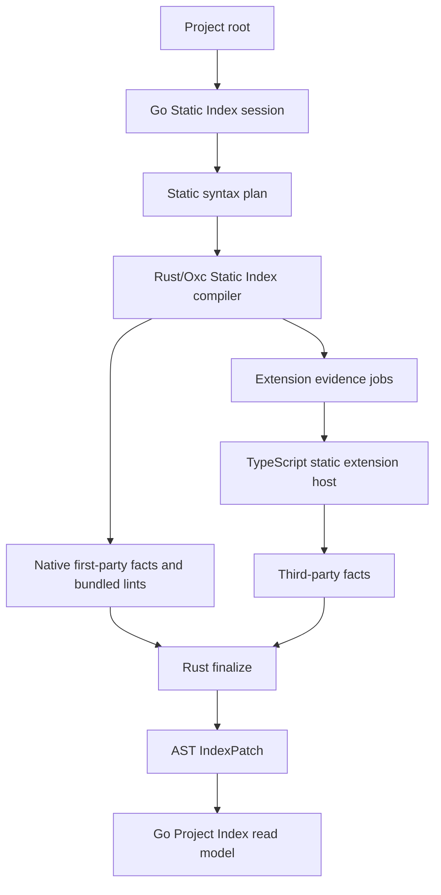
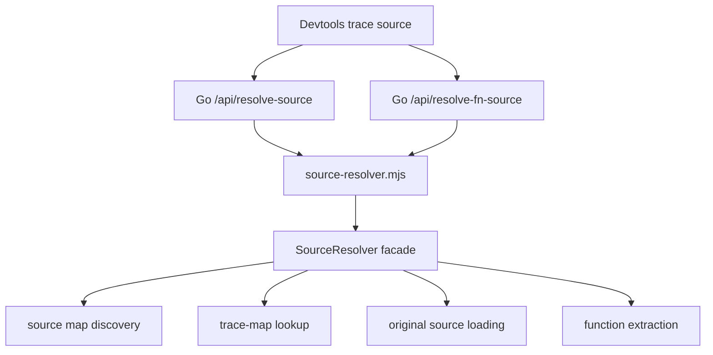
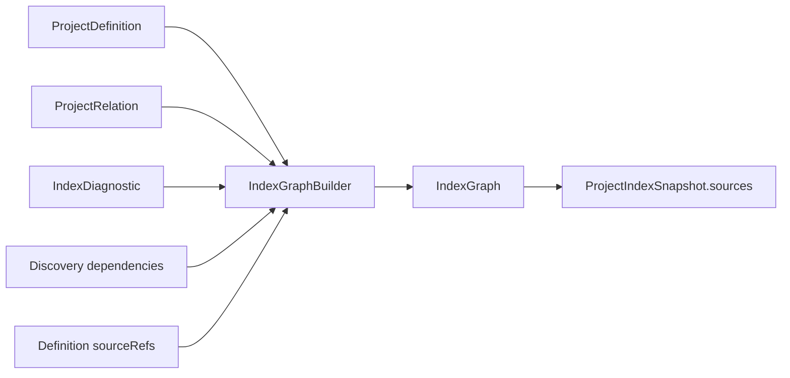
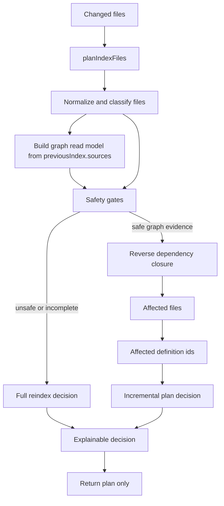
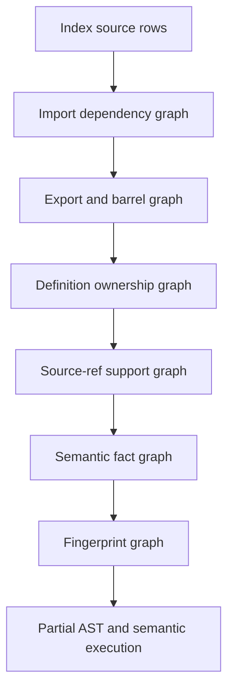
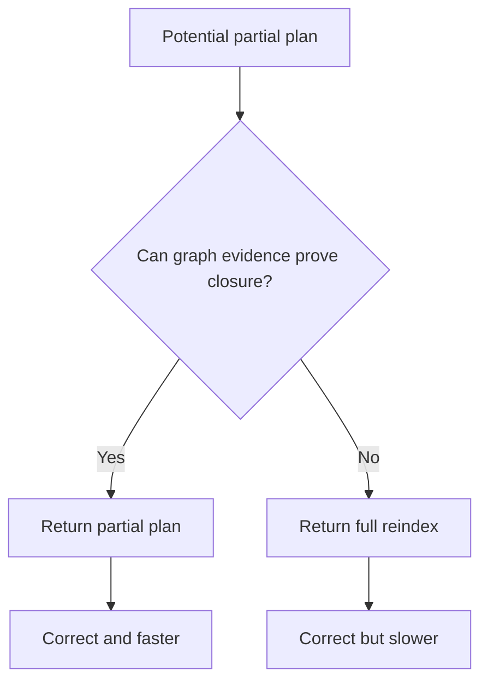
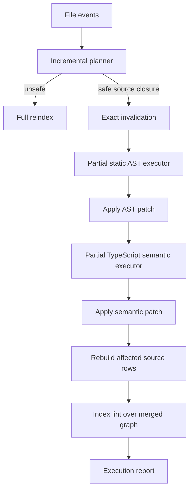

# @use-crux/indexer Architecture

`@use-crux/indexer` turns authored project source into the Project Index facts served by
`@use-crux/local`. It owns static source discovery, semantic enrichment, source references, index
relations, index lint facts, and the source graph read model used to explain authored Crux systems.

The package should stay correctness-first: when source graph evidence is incomplete, stale, or
ambiguous, indexing must fall back to a full project reindex instead of publishing a partial index
that might omit affected facts.

## Accepted Target Architecture

The accepted direction is to use **Crux Indexer** for the public system and
**Project Index** for the output/read model. `@use-crux/indexer` is the package name, while
`ProjectIndex*` identifiers are artifact/read-model names rather than legacy system names. New
architecture decisions should use this language:

- Public system name: **Crux Indexer**.
- Target package name: `@use-crux/indexer`.
- Output/read model: **Project Index**.
- Internal engine: **Rust Static Index compiler + TypeScript extension host**.
- Extension ecosystem: **Indexer Extensions**.

The Indexer is a compiler-style project intelligence system, not an AST plugin framework. The public
extension contract exposes facts, relation specs, and compiler-owned diagnostics through extractors. Rules, resolvers, emitters, queries, and read-model execution remain reserved. The Rust
Static Index compiler owns first-party parser traversal, graph assembly, bundled lint finalization,
and source patch projection. TypeScript owns third-party extension hosting, semantic backends,
config/runtime host work, cache identity helpers, and JSON-safe contract mirrors.

The internal TypeScript static extraction engine exists for extension fixtures and compatibility
tests that run against explicit syntax-record frontends. It is not a host source-patch API and is not
the bundled first-party implementation. Cache identity includes extension and extractor identities,
profile/projection inputs, and the selected syntax frontend identity, so parser/frontend upgrades
invalidate fixture extraction structurally instead of relying only on manual epoch bumps.

Published package surfaces:

- `@use-crux/indexer` — Crux-owned compiler contracts, not third-party authoring
- `@use-crux/indexer/extensions` — experimental extractors and relation declarations
- `@use-crux/indexer/testing`
- `@use-crux/indexer/source-resolver`

Crux-owned host and contract surfaces:

- `@use-crux/indexer/host`
- `@use-crux/indexer/host/static-index`
- `@use-crux/indexer/host/semantic`
- `@use-crux/indexer/host/runtime`
- `@use-crux/indexer/host/static-compat`
- `@use-crux/indexer/contracts/worker-events`
- `@use-crux/indexer/contracts/static-index`
- `@use-crux/indexer/contracts/static-syntax`
- `@use-crux/indexer/contracts/semantic`

`@use-crux/indexer/testing` exposes source-text fixtures for extension authors. Fixtures use the same
static extraction engine as production with an in-memory `SourceReader` and `cache: 'none'`, which
keeps extension tests on the public source-text-to-facts path rather than hand-building parser-native
contexts. The testing harness uses the in-process TypeScript syntax-record producer as its fixture
default and reports the selected producer on `trace.syntaxFrontend`.

`@use-crux/indexer/contracts/*` is the TypeScript-owned contract spine for worker-event, Static Syntax,
Static Index, and Semantic Evidence protocols. The contract manifest records the canonical fixture,
version, and Go/Rust mirror inventory that `scripts/check-indexer-contracts.mjs` validates.
`@use-crux/indexer/host/*` exposes focused Crux-owned worker bridges for static planning/config,
semantic enrichment, runtime patching, and Static Index compatibility-host calls. They are published
compiler/build boundaries, not application SDK or third-party authoring promises.

The stability promise is granular:

- The root, `host/*`, and JSON-safe `contracts/*` subpaths are Crux-owned compiler/build contracts.
  `testing` and `source-resolver` are focused public facades rather than broad compiler APIs.
- `@use-crux/indexer/extensions` remains experimental. Its `ExtractContext` reader/builder shape is
  frozen, but third-party loading, trust UX, reserved execution slots, and fixture package contracts are not
  stable plugin ecosystem promises yet.
- `@use-crux/indexer/host/*` is Crux-owned. `host/static-index` owns static config/plan inspection.
  `host/static-compat` owns the Node calls used by the Rust Static Index compiler for third-party
  extractor evidence and compiler-owned rule checks.

Local TypeScript worker bundles are owned by the private `packages/local-workers` package.
`@use-crux/devtools` owns only the React/Vite UI and UI-local tests.

Accepted non-public surfaces:

- compiler profiles and compiler-owned projections
- parser construction and AST internals
- graph builders
- resolver and emitter internals
- cache internals
- raw TypeScript `Program`, `TypeChecker`, and AST nodes

The accepted analysis tiers are:

```ts
type AnalysisTier = "syntax" | "index" | "semantic";
```

`syntax` is file-local and parser-backed, `index` is project-level Project Index analysis, and
`semantic` is optional type/program-aware analysis exposed through a stable `SemanticReadModel`.
Compiler-owned analyzers opt into semantic cost through internal requirements. The public extension
surface exposes neither semantic analyzer/rule slots nor raw TypeScript compiler objects.

See ADRs 0004-0009 for the accepted terminology, public extension contract, analysis tier,
loading/trust decisions, and code-is-config project discovery boundary.

## Current Pipeline



The public package root exposes Crux-owned compiler and record contracts.
Experimental third-party extractor and relation authoring lives under
`/extensions`. Crux-owned execution facades live under `host/*` and are consumed by
local worker bundles for config/runtime/semantic work and third-party Static
Index extension evidence. Go/Rust produce source patches.

- `resolveProjectModel(...)` is host-only and produces the JSON-safe config/read-model view with provenance for selected root, package metadata, config status, source roots, ignored conventions, config-derived definitions, Quality defaults, and Project Model diagnostics.
- `inspectProjectConfig(...)` (in `indexer/project-config-inspect.ts`) produces the effective-config
  read model behind `crux config inspect`. It imports `crux.config.ts` via `loadProjectConfig`
  (`CRUX_INDEX=1`, inert), merges built-in defaults across every `CruxConfig` domain, and tags each
  value with an origin (`config` / `default` / `package.json` / `set` / `none`). It reuses
  `resolveProjectModel` for the compact discovery summary and degrades to all-defaults with an
  `import-failed` status on a broken config.
  Internally, `cruxCoreCompilerProfile` records stable profile/projection identity used by the
  TypeScript extension host and fixture extraction. Profiles keep extension execution instance-local;
  there is no process-wide public extension registration.

First-party syntax extraction, relation finalization, and bundled lint evaluation are Rust-owned in
the binary. TypeScript extension runtime remains for third-party extractor and relation manifests that
run against Rust-produced syntax/evidence records. The remaining profile projection records are cache
identity inputs for fixture and extension-host construction rather than a second bundled projector.

Semantic analysis remains compiler-owned internal analyzer code. Crux-owned hosts may consume the
stable `SemanticReadModel`, but the public extension authoring surface exposes no semantic requirement
or analyzer slot and no raw TypeScript `Program`, `TypeChecker`, or AST nodes. Static relation
resolution is likewise compiler-owned for now, exposed internally through a functional boundary while
public resolver authoring remains reserved.

Internal package code is organized around compiler responsibilities instead of keeping every engine
module in the `indexer/` root:

- `indexer/compiler/`: profile/runtime identity helpers for extension-host construction.
- `indexer/static/`: source-local parsing, static fact extraction, static cache, static discovery, and
  compiler-owned static projections such as runtime prepare/use facts.
- `indexer/semantic/`: semantic fact orchestration, analyzer registry, semantic candidates, expression
  resolution, source refs, and data-access relation discovery.
- `indexer/lints/`: built-in rule descriptor readers sourced from the Rust descriptor fixture.
- `indexer/relations/`: relation policy types, grouped policy catalogs, relation lookup, and relation
  id/build helpers.
- `indexer/extensions/`, `indexer/incremental/`, `indexer/graph/`, and
  `indexer/ast/`: existing compiler subdomains.

The root `indexer/` folder should stay reserved for small package-level orchestration and shared
compiler utilities such as config loading, project paths, source rows, patch contracts, merge helpers,
and public package entry shims. New static, semantic, lint, relation, graph, extension, or incremental
implementation code should land in the matching folder rather than creating another large root file.
Within each folder, keep orchestration files small and extract reusable projection, builder, evidence,
policy, or source-ref helpers once a file starts owning more than one compiler responsibility.

## Local Read-Model Boundary

The Project Index Compiler emits raw Project Index snapshots and patches. `@use-crux/local` stores
those raw values for cache writes and runtime snapshot merging, while its Project Index read model may
add only local source metadata needed by Index consumers.

Eval runs and Baselines, Inspect insights, and Review records have separate Local read models and
filesystem owners. They are not Project Index facts and must not be joined into compiler snapshots or
persisted in Project Index caches. This keeps `@use-crux/indexer` responsible for authored source facts
while Local owns runtime and repository projections consumed by HTTP, websocket, TUI, and Devtools
surfaces.

## Project Model And Configuration Boundary

The Project Index is the source-derived part of the resolved Crux project model. It should discover
authored Crux definitions and relationships from code rather than requiring users to repeat those
relationships in a central config file.

The architectural rule is:

> Explicit construction decides behavior; Crux discovery provides visibility.

The Indexer may infer prompts, contexts, tools, memories, retrieval definitions, flows, agents,
quality suites, `use[]` relationships, source roots, package roots, and stable source references when
those facts are visible in code. If a relationship is authored in code, such as a prompt using a
memory that was constructed with a store, a local tooling config must not also require the user to
register that prompt, memory, and store in a registry list.

Config remains valid for policy, trust, and overrides:

- source include/exclude overrides;
- lint profiles and rule options;
- third-party Indexer Extension references and trust policy;
- unusual monorepo root hints;
- cloud/training upload, retention, and raw-content policy;
- explicit runtime behavior such as telemetry, extension trust, stores, providers, and destructive
  capabilities.

When discovery cannot prove a fact, the compiler should emit a diagnostic with a small fix: add a
stable id, make a relationship statically visible, add an include override, or choose an explicit
policy. The preferred fix is not "register it in config" unless the missing fact is actually a policy,
trust, or ownership decision.

The resolved project model should preserve provenance for every field: inferred from source, observed
from runtime evidence, loaded from local filesystem conventions, or explicit from config.
`resolveProjectModel(...)` is the package facade for that source-discovery read model. `crux config
inspect` instead renders the effective configuration via `inspectProjectConfig(...)`, which imports the
config to show every `CruxConfig` domain with explicit-vs-default origins, and folds in a compact
discovery summary from the project model — so users see both what they configured and what Crux
inferred, without config becoming a second product model.
Project Model diagnostics are projected from index diagnostics and selected lint findings: no-config
source discovery is informational, and actionable source-shape findings such as missing stable ids or
runtime-dependent tool maps keep their source provenance and small fixes.

## Experimental Extension Boundary

The Project Index Compiler has an experimental Crux Indexer Extension boundary. The boundary uses
role-based compiler slots instead of exposing internal execution/cache phase names as API:


Bundled first-party static facts are emitted by the Rust Static Index binary. The TypeScript
extension host remains only for third-party extractor contributions and relation declarations, which emit immutable
intermediate facts, unresolved references, source refs, diagnostics, and dependency declarations.
Resolver slots link unresolved references into validated Project Index relations after definitions
are known. Rules run over resolved index facts. Emitters remain compiler-internal and produce
snapshots, patches, source rows, and reports.

The boundary is intentionally pure-functional at the slot level: extensions return values, and the
compiler owns validation, merge order, source graph projection, cache keys, patch invalidation, and
full reindex fallback. The executable boundary for this model should be an Extension Runtime: a
compiler-owned functional module that normalizes Crux Indexer Extension manifests, records
deterministic contribution identity, runs compiler slot contributions, and returns immutable result
objects. The runtime must not be a mutable plugin manager or global registry service.

Third-party static extractors emit immutable `ExtractedFacts` through the extension runtime, and
the host projection path merges those facts with native Rust/Oxc output. Bundled first-party
extractors and lints are Rust-only. Project Index snapshots and AST patches still carry
`ruleDescriptors`, a metadata list for compiler-owned rules whether or not they fired findings.
Compiler-owned index rules declare metadata with docs, schema, and message ids before registry
construction succeeds. Raw TypeScript nodes are not a stable extension API.

The static extractor context remains available for third-party extensions:
`ctx.args` for factory arguments, `ctx.config` for object-literal/static
JSON/schema projection, and `ctx.sourceRef` for property, callback, schema,
template interpolation, and helper source refs.

The `@use-crux/indexer/extensions` subpath is experimental. It is documented so first-party
internals and tests can use the same shape that future external extension loading may adopt, but it
does not yet promise stable third-party plugin support.

Third-party loading is config-driven and allowlisted. `@use-crux/core` stores inert
`config({ indexer: { extensions, trust, rules } })` data for local tooling, and `@use-crux/indexer`
enforces that data when constructing a compiler runtime. The effectful loader preflights trust by
configured package name before import, resolves packages from the project root, reads the installed
package version from package metadata, imports the selected package export, and then delegates to the
pure resolver for manifest-name trust, requested package-version checks, manifest validation, and
`crux.indexer`/Project Index schema compatibility. There is no global registration, implicit package
discovery, or background side-effect hook.

`resolveIndexerExtensionReferences(...)` remains the pure manifest-only gate for tests and tooling
that already have extension objects. `loadIndexerExtensionReferences(...)` is the only public helper
that performs package resolution/import, and it should stay explicit about trust because importing a
Node package is code execution, not a sandbox.

Relation read-model projection is public compiler data, not app policy. Runtime `use` entries that
name ambient resources are matched through `RuntimeUseTargetRules`; product-specific ids or aliases
must be supplied as data by the host/profile instead of hardcoded in `relations/index.ts`.

The package export map intentionally separates Crux-owned public compiler contracts, experimental
authoring surfaces, and host/internal bridges. `@use-crux/indexer` exposes Crux-owned compiler and
record contracts; `@use-crux/indexer/extensions` exposes experimental extractor and relation
authoring; and `@use-crux/indexer/testing` plus `@use-crux/indexer/source-resolver` are focused public
tooling. `@use-crux/indexer/host/*` and `@use-crux/indexer/contracts/*` remain Crux-owned host and
cross-runtime contract surfaces. Other compiler and indexer modules are reached by relative imports
inside the package so they do not accidentally become third-party API.

### Extension Runtime

The Extension Runtime is the functional execution boundary for Crux Indexer Extensions. It lives
behind internal compiler imports and keeps the public experimental extension authoring barrel focused
on authoring helpers rather than runtime control.

The runtime is functional and value-oriented:

- Inputs are readonly compiler views, extension manifests, and fact packets.
- Outputs are discriminated runtime results, diagnostics, dependency declarations, and immutable
  facts.
- Runtime manifests expose deterministic extension/extractor identities plus compiler-owned rule
  identities and cache inputs.
- Static cache keys combine source hashes, import dependency hashes, config boundary hashes,
  extension runtime identity, compiler profile identity, and compiler-owned projection identity. The
  remaining manual invalidation levers are explicit epochs in `indexer/cache-identity.ts`.
- Semantic cache keys combine the analyzed source closure, config boundary hashes, TypeScript
  version, and semantic compiler-options identity. Semantic fact-format changes use
  `SEMANTIC_FACTS_CACHE_EPOCH`; Go-owned persisted snapshots use `projectIndexSnapshotCacheEpoch`
  in `@use-crux/local`.
- No extension code receives graph builders, cache handles, mutable diagnostics arrays, or stable raw
  TypeScript AST APIs.
- Existing compatibility helpers delegate to the runtime during migration, but the runtime is the
  architectural boundary for slot execution.
- Runtime construction happens from a Compiler Profile, so tests and future loaders can create
  isolated compiler instances without mutating global registry state.

The first runtime implementation is behavior-preserving and scoped to static extraction plus
runtime-adjacent compatibility helpers:

- `extractStatic(...)` runs static extractor contributions and returns `no-match`, `none`, `matched`,
  or `degraded` results.
- `staticFoundDefinitionFromStaticExtractionResult(...)` projects runtime facts into the current
  static parser compatibility shape.
- Relation binding is owned by `resolveRelationModel(...)` in `indexer/relations/`, so static
  extractor references, project-scope relation facts, policy validation, diagnostics, and read-model
  enrichment pass through one compiler-owned facade instead of extension-runtime compatibility
  helpers.
- `checkRules(...)` runs internal index rule contributions in deterministic extension/rule order and
  returns `IndexLintFinding` values for downstream config/suppression filtering.
- Rule metadata is validated at registry construction time. Malformed rules fail before source
  discovery starts.
- Rule identities are included in runtime cache inputs as `{ kind: "rule", extension, name }` so future
  query/incremental caches can invalidate rule output when first-party rule behavior changes.

The runtime does not pull semantic enrichment, incremental execution, or source resolver behavior into
extension code. Public loading constructs additional compiler runtimes from allowlisted package
manifests, but semantic analyzers, parser traversal, resolver internals, emitters, cache writes, and
snapshot projection remain compiler-owned.

## Source Resolver Boundary

The source resolver is part of this package because it needs to run near local project artifacts, but
it is not part of Project Index indexing. It supports runtime trace and span inspection in
devtools:



This boundary should stay distinct from `project-indexer.mjs`:

- Project indexing is ahead-of-time index construction over authored project files.
- Source resolution is lazy runtime lookup from bundled file, line, and column positions.
- Index source refs can enrich project intelligence, but they do not replace source-map lookup for
  bundled runtime frames.

The stable import remains `@use-crux/indexer/source-resolver`. Internally, the implementation is
organized as a small stateful facade over pure functional modules:

- `source-resolver/filesystem.ts`: injected filesystem effects.
- `source-resolver/discovery.ts`: source-map discovery and path normalization.
- `source-resolver/trace-map.ts`: trace-map parsing and original position lookup.
- `source-resolver/original-source.ts`: `sourcesContent` and disk fallback loading.
- `source-resolver/extraction.ts`: function-like source extraction.
- `source-resolver/cache.ts`: cache keys, limits, and eviction policy.
- `source-resolver/protocol.ts`: JSON-line worker request parsing and response serialization.
- `source-resolver/resolver.ts`: `SourceResolver` compatibility facade.

The facade may hold cache state for runtime efficiency. Helper modules should remain documented,
mostly pure, and directly testable.

## Source Graph Read Model

The durable graph currently exposed to callers is `ProjectIndexSnapshot.sources`. Each
`IndexSourceFile` row records:

- `file`: the authored source path.
- `definitionIds`: index definitions produced by the file.
- `dependencies`: source files this file imports or references.
- `dependents`: source files that depend on this file.
- `diagnostics`: indexer diagnostics attached to the file.

This read model is intentionally plain JSON so it can cross the TypeScript worker and Go runtime
boundary. Internally, `indexer/graph` uses branded IDs and maps to construct the richer graph before
projecting it back into index source rows.



## Incremental Planner and Executor

Incremental indexing is split into a pure planner and an executor. The planner decides what a file
change would affect. The executor either turns planner-approved closures into exact-invalidation
patches or delegates unsafe decisions to the existing full indexing paths.



The planner exists to establish the same invariant used by compilers and build systems:

> A partial plan is allowed only when the graph can explain the affected closure. Otherwise the
> planner must request a full reindex.

The current implementation uses `previousIndex.sources` as graph evidence. Later work may add richer
graph evidence without changing the high-level planner contract.

## Planned Incremental Layers



The planner should scale by improving graph evidence in layers:

1. **Index source rows**: existing durable graph rows in `previousIndex.sources`.
2. **Import dependency graph**: static import edges, including path aliases when the resolver proves
   the target.
3. **Export and barrel graph**: edges that distinguish re-export files from definition-owning files.
4. **Definition ownership graph**: mapping of definitions to producing and contributing files.
5. **Source-ref support graph**: schema, callback, template, and helper source references that
   contribute metadata without always producing definitions.
6. **Semantic fact graph**: TypeScript-resolved aliases, schemas, callbacks, and relation facts.
7. **Fingerprint graph**: content and config hashes that support reusing cached facts.

Each layer should be additive. Missing evidence at any layer reduces optimization, not correctness.

## Planner Decisions

Planner decisions should be a discriminated union with stable reason codes. The exact TypeScript
names can evolve, but the architecture should preserve these categories:

- `full-reindex-required`: graph evidence is missing, ambiguous, stale, or a broad boundary changed.
- `source-file-reindex`: changed files are known leaves with locally owned index facts.
- `dependency-closure-reindex`: changed files affect known dependents through the reverse source graph.
- `semantic-closure-reindex`: typed vocabulary for future source-ref or checker-backed facts that
  require semantic enrichment; defined and explainable before it is emitted.
- `noop`: future category for changes proven irrelevant to index output.

Every decision should include normalized changed files, affected files, affected definition IDs when
known, graph confidence, and an explanation payload suitable for worker logs.

`semantic-closure-reindex` remains reserved planner vocabulary. Current semantic partial execution is
file-closure based: it enriches known index-owning files and semantic source-ref support rows inside
planner-approved AST closures. Checker-only closure decisions should still fall back until durable
semantic graph evidence can prove the affected set.

`noop` is documented as a future category only. The first planner implementation should not emit it
because a false no-op can silently preserve stale index facts.

## Safety Gates

The planner must return `full-reindex-required` when any of these conditions apply:

- No previous index is available.
- The previous index has no source rows or no dependency/dependent evidence.
- A config, compiler, package manifest, or lockfile changed.
- A changed source file is not represented in the previous graph.
- A dependency target cannot be resolved with confidence.
- A deleted file cannot be mapped back to previous graph ownership.
- The affected closure exceeds a configured budget.
- The graph contains unresolved import diagnostics relevant to the changed files.

Dynamic imports, side-effect imports, path alias oddities, generated files, deleted files, and config
changes are reliability hazards only if treated optimistically. The intended behavior is conservative:
fallback first, optimize later when graph evidence can prove the affected closure.



## Proven Architecture Basis

The planner should follow established incremental architecture rather than invent a Crux-specific
shortcut.

| System                                               | Architecture lesson                                                                                          | Crux equivalent                                                                         |
| ---------------------------------------------------- | ------------------------------------------------------------------------------------------------------------ | --------------------------------------------------------------------------------------- |
| TypeScript project references and incremental builds | Persist graph/build metadata and explain up-to-date decisions separately from compilation.                   | Use index source rows as graph metadata, then execute indexing in later phases.         |
| Bazel Skyframe                                       | Invalidate reverse dependencies from changed inputs; undeclared dependencies make incremental reuse unsound. | Walk `dependents` from changed files and fall back when dependencies are not declared.  |
| rustc query system                                   | Track query dependencies and fingerprints so unchanged facts can stay green.                                 | Future static, semantic, and lint facts can become independently reusable graph facts.  |
| ESLint cache                                         | Separate changed-file classification and cache strategy from lint execution.                                 | Keep file classification and invalidation planning separate from AST/semantic indexing. |
| Nx and Turborepo                                     | Use explicit project/task graphs to compute affected work before executing tasks.                            | Compute affected source/index work before partial index workers run.                    |

## Testing Strategy

Planner work should use vertical TDD slices through the public planner interface:

1. Missing graph data returns a full reindex decision.
2. A known source leaf returns a source-file plan.
3. A changed dependency walks reverse dependents deterministically.
4. Config and compiler boundary changes return full reindex.
5. Unknown or deleted files return full reindex unless previous ownership is provable.
6. Explanation generation handles every decision kind exhaustively.

Tests should verify behavior through public planner functions, not private traversal helpers. Type-level
tests or `never` exhaustiveness checks should protect discriminated-union handling.

## Implementation Boundaries

The incremental planner is not the incremental executor. Planner modules stay pure and explainable;
executor modules own analyzer calls, patch construction, fallback routing, and execution reports.

The Go runtime remains the read-model owner. Static incremental execution is
Go/Rust-owned; `@use-crux/local` can call it with a previous index plus
changed/deleted files, then apply the returned patches through the same index
patch state used by AST and semantic refreshes.

## Incremental Execution Architecture

The production execution phase wires the planner into an executor that keeps full indexing as the
reference implementation. Incremental execution is a smaller invalidated run through the same static
AST analyzers, TypeScript semantic analyzers, merge functions, lint analyzers, graph builder, and
patch application semantics.



The executor should follow proven incremental-system patterns:

| Proven system                 | Production lesson                                                                     | Crux execution rule                                                                                    |
| ----------------------------- | ------------------------------------------------------------------------------------- | ------------------------------------------------------------------------------------------------------ |
| TypeScript builder programs   | Reuse diagnostics/work only when changed files and cascading dependencies are known.  | Execute semantic work over the planner's affected closure first; consider builder-program reuse later. |
| Bazel Skyframe                | Reads outside the dependency graph break incremental correctness.                     | Every analyzer dependency must be recorded in query fingerprints or force fallback.                    |
| rustc/Salsa red-green queries | A changed input can still keep dependents reusable when its output is unchanged.      | Add output equality reuse after file-level partial execution is proven equivalent to full indexing.    |
| ESLint cache                  | Content-hash cache strategy is safer than mtime-only detection across git operations. | Fingerprint source/config content, not only file metadata.                                             |
| Turborepo                     | Cache hits require deterministic tasks with declared inputs and outputs.              | Model static, semantic, lint, and source-graph facts as deterministic query records.                   |

Initial query records should stay file-level:

- `StaticParse(file)`: source hash, parser/extractor version, config boundary hashes, resolved import
  target hashes -> definitions, relations, source refs, diagnostics, dependency edges.
- `SemanticAnalyze(file, analyzer)`: source hash, analyzer version, TypeScript version, compiler
  options hash, resolved module graph hash, static candidate hash -> semantic definition patches,
  relations, source refs, diagnostics.
- `IndexLint(ruleProfile)`: merged definitions/relations plus the compiler-owned rule profile and lint
  config/suppressions -> lint findings.
- `SourceGraph(component)`: affected rows, dependency edges, ownership maps -> normalized
  `IndexSourceFile` rows and a trusted `sourceGraph` marker.

The executor must preserve these invariants:

- A partial patch must declare exact `invalidates.files` and `invalidates.definitionIds`.
- Patch application must remove stale file-owned, definition-owned, diagnostic, source-ref, relation,
  source-row, and lint facts before merging replacements.
- Go index patch application must honor exact invalidation before merge, including definitions,
  relations, diagnostics, lint findings, source rows, and phase ownership maps.
- Index-level lint runs after the partial static/semantic patches are merged because it depends on
  the merged graph.
- Source graph rows for affected files and direct neighbors are rebuilt together so dependency and
  dependent edges remain symmetric.
- If any analyzer reads unregistered input, any cache fingerprint is incomplete, or any graph marker
  capability cannot be preserved, the executor falls back to full reindex.

The rollout should begin in shadow mode: compute the partial patches, apply them to the previous
index state in memory, compare the normalized result to a full reindex in tests and diagnostic runs,
and publish partial results only after equivalence is stable across fixtures.

Implemented v1 behavior:

- Go/Rust incremental indexing emits exact-invalidation AST patches for
  `source-file-reindex` and `dependency-closure-reindex` decisions.
- Semantic enrichment follows through the semantic worker for known index-owning
  source files and semantic source-ref support files in the affected closure.
- Unsafe plans, old snapshots, unknown files, config changes, unsupported semantic closures, and
  incomplete graph evidence fall back to full indexing.
- Safe deleted leaf files emit invalidation-only AST patches.
- Execution reports are JSON-safe and include planner kind, fallback reason, affected files,
  affected definitions, parsed/analyzed files, invalidation, and cache counters.
- The devtools Go patch applier supports exact file/definition invalidation and source-row union
  merging, so runtime partial patches no longer require all-or-nothing invalidation.
- The local Project Index service and TypeScript worker bundle have an incremental bridge. The service falls
  back to full reindex if no previous source graph or incremental-capable worker is available.
- Incremental worker patches are streamed as bounded V2 events. Source-profile rows are carried as
  `sourceProfile:batch` events rather than as one large patch payload, and semantic workers receive
  profile files in bounded batches from the Go runtime.
- Incremental worker requests also chunk large `previousIndex` definition/source arrays into
  `previousIndex:definitions` and `previousIndex:sources` request events before the final `done`
  event, so watch-mode deltas do not require sending one huge JSON request to the long-lived worker.
- Watch-triggered runs carry a monotonic run id plus queue coalescing telemetry. The local service
  publishes the latest bounded status at `GET /api/project/index/watch`, including plan kind,
  fallback reason, affected counts, patch counts, semantic status, stale-semantic drops, and phase
  timings.

Known v1 boundary:

- First-run semantic support files, such as schema modules that have not yet been seen by semantic
  enrichment, are still `unknown-file` planner fallbacks. After semantic enrichment emits source-ref
  support rows, those files become durable graph nodes and can participate in partial semantic
  reindexing.
- HTTP/API delta triggering is wired through `POST /api/project/index/reindex` and
  `POST /api/index/reindex` when the request body includes `files` or `deletedFiles`.
- `crux dev` starts a Go `fsnotify` watcher after the initial full index reindex succeeds. The
  watcher recursively registers project directories, ignores generated/cache directories, debounces
  event bursts, coalesces changed/deleted file sets, and feeds a single-flight incremental reindex
  runner so index refreshes never overlap.
- Opt-in watch benchmarks live in `@use-crux/local-workers` (`perf:indexer:watch`) for
  planner/AST/semantic worker timing. Go-side
  patch commit and projection timing lives under `packages/local/internal/devtools`. These benchmarks
  are not part of deterministic default CI.

For the incremental planner rationale, see
[ADR-0001](./docs/adr/0001-incremental-planner-before-partial-execution.md).
