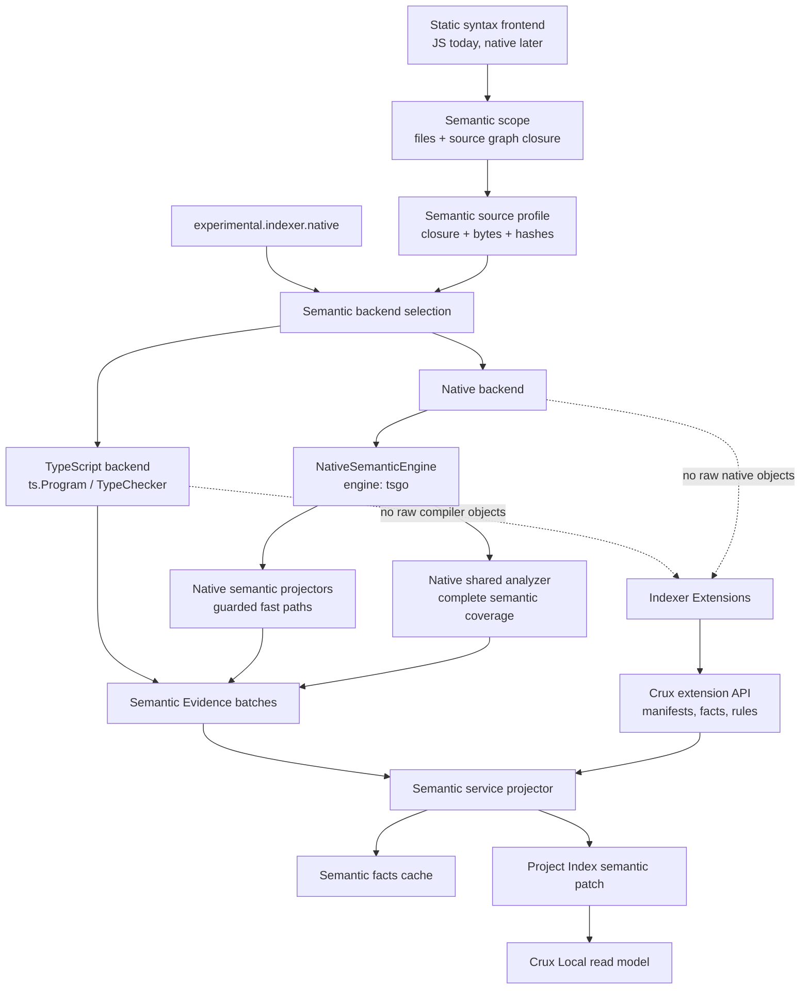

# ADR 0011: Semantic Evidence for Native Backends

Status: Accepted

Date: 2026-06-19

## Context

Crux supports interchangeable semantic backends for Project Index enrichment. The JavaScript
TypeScript compiler API backend is the default correctness baseline, while the native backend is
experimental. TypeScript-Go is the first native engine because the upstream native-preview API gives
Crux a native TypeScript parser/checker path, but it is not the public product concept.

As of 2026-06-20, the native backend has exact normalized fact parity for the current supported
semantic contract and for the real Karyla backend package. It remains experimental because the
upstream TypeScript-Go native-preview API is unstable and because default-switch confidence needs
longer-running benchmark coverage.

The native backend uses TypeScript-Go for semantic ownership. It can lower high-volume source shapes
through direct native projectors and routes the remaining supported semantic surface through a
tsgo-owned shared analyzer path. That shared path is part of the native backend and is not a
JavaScript TypeScript semantic fallback. It currently uses a TypeScript AST facade for structural
traversal while native-preview owns project/checker state. To benefit further from native compiler
work, Crux needs the future syntax frontend to replace the facade with native AST traversal without
exposing TypeScript compiler nodes, `TypeChecker` objects, or TypeScript-Go internals to workers or
Indexer Extensions.

## Decision

Semantic backends emit **Semantic Evidence**: compiler-free Crux rows keyed by evidence kind
(`definitions`, `relations`, `sourceRefs`, `diagnostics`, and `lintFindings`). The semantic service
projects those rows into Project Index patch facts through one shared projector.

Backends may use any internal traversal strategy:

- Static/source indexing remains a separate syntax-frontend concern. It can move from JavaScript to
  Rust/Oxc or another native parser before semantic indexing changes, as long as it emits the same
  Project Index facts and source graph rows.
- Crux Local hands the semantic worker an explicit semantic scope from the AST/source patch:
  selected files, previous index snapshot, and source-graph-derived dependency closure when trusted.
  The semantic service then builds a `SemanticSourceProfile` once and shares its closure, byte counts,
  hashes, and transient source text with cache identity and backend execution. Future Go/native
  syntax frontends can provide equivalent fingerprints before JavaScript worker execution, but the
  backend contract stays the same.
- The TypeScript backend can continue using `ts.Program` and `TypeChecker`.
- The native backend owns a `NativeSemanticEngine` contract. The first engine is `tsgo`, which
  reuses native-preview API hosts, batches checker calls where the API supports it, and moves toward
  native-owned traversal and evidence lowering.
- Native engines may add guarded native evidence projectors for high-volume source shapes. A
  projector must emit the same Project Index facts as the TypeScript backend for every supported
  shape and return no facts for unsupported syntax so the native shared analyzer can take over inside
  the same native backend.
- Native projectors should be driven by explicit primitive projection manifests wherever the shape
  can be represented as data: call names, definition identity fields, schema-bearing properties,
  dependency relations, source-ref roles, and supported local reference forms. First-party native
  projector behavior must not live as unexplained hardcoded primitive branches when an equivalent
  manifest entry can express it. Unsupported first-party or third-party primitive shapes must route
  through the native shared analyzer rather than being ignored by a native projector.
- A future Rust or other native backend can implement the same evidence stream without changing the
  service, worker protocol, cache projection, or extension contracts.

Indexer Extensions remain supported through Crux-owned manifests, extractors, rules, and read models.
They should consume Crux facts/read models, not raw compiler AST or checker APIs.

## Consequences

- `SemanticAnalyzeResult` is a `SemanticEvidenceBatchSource`, not a compiler object graph.
- Semantic fact caching stores projected Project Index facts, but cache misses stream evidence from
  the selected backend before projection. Current cache writes use the binary local envelope after
  the `semantic-facts-v15` hard migration.
- Semantic preflight produces one source profile for a request. Cache identity, native projector
  guards, and backend setup consume that profile instead of independently rereading selected sources.
- Project Index workers stay alive across hot indexing requests. Patch-producing worker streams are
  request-scoped transactions over persistent NDJSON processes, so backend/session caches are useful
  during `crux dev` watch updates.
- The native backend may retain reusable native engine sessions per semantic project identity, but
  each analysis request owns its source snapshot and temporary config.
- Backend parity tests compare projected facts from both backends; adding a semantic feature means
  updating both backend behavior and the parity fixture matrix in the same change.
- Native backend performance work should reduce bridge calls by producing evidence closer to the
  native compiler traversal instead of mirroring JavaScript compiler APIs one method at a time.
- Native fast paths are optimizations behind the semantic evidence contract, not separate feature
  sets. The native shared analyzer remains the completeness path until a native projector proves exact
  normalized fact parity for its supported syntax matrix.
- Primitive projection manifests are internal compiler data, not a public native-plugin API. Indexer
  Extensions remain backend-neutral: extension authors contribute manifests, extracted facts, rules,
  and relation specs through the existing extension boundary. Native acceleration for extension
  primitives can be added only when the extension declaration is expressive enough for a native
  projector to prove exact parity; otherwise the native shared analyzer path remains authoritative.
- Worker protocol helpers should stream fact batches without materializing full event arrays. Go
  still validates and commits patches transactionally after `phase:done`.

## Validation

Implementation must keep coverage at these boundaries:

1. Evidence projector tests prove batches materialize into Project Index patch facts.
2. Semantic backend parity tests compare normalized projected facts for TypeScript and native across
   the supported semantic fixture matrix and representative real packages.
3. Compiler-runtime CI tests run backend selection and configless native coverage.
4. Public surface tests include the evidence batch types and reject accidental compiler API exports.
5. Native fast-path tests must prove both exact normalized fact parity and fast-path selection.
6. Manifest-known primitive calls that are not native-projectable must prove native shared-analyzer
   coverage so native projectors cannot emit partial fact sets.
7. Native backend tests must prove unsupported direct-projector shapes stay inside the native shared
   analyzer path and do not use the JavaScript TypeScript semantic backend as a fallback.
8. Semantic cache tests must prove binary cache reads/writes and epoch-driven hard migration.
