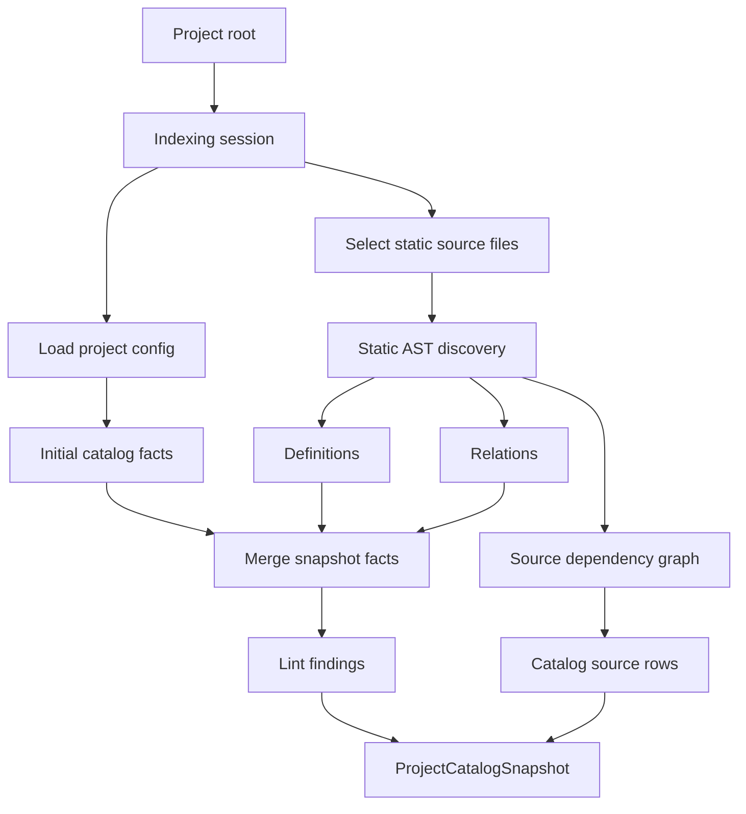
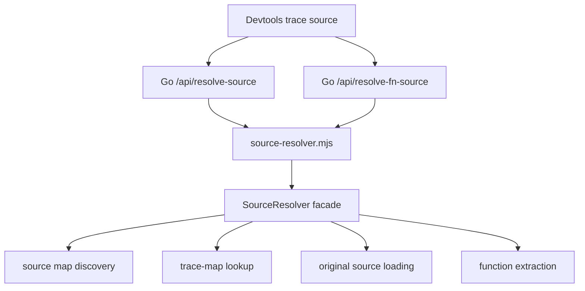
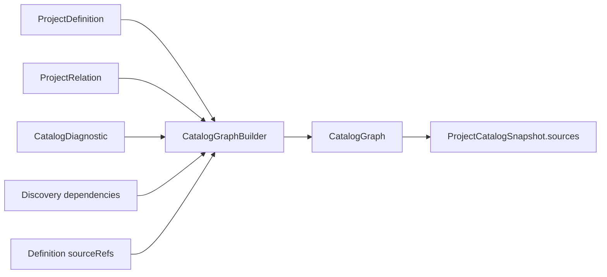
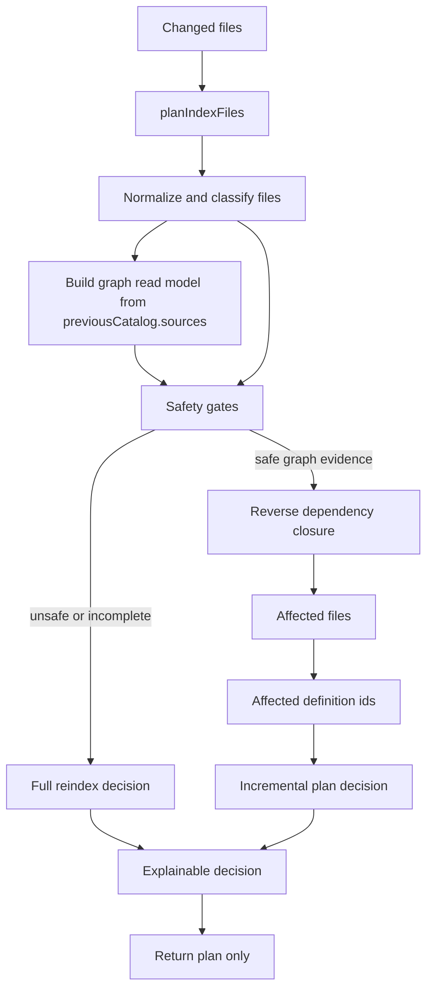
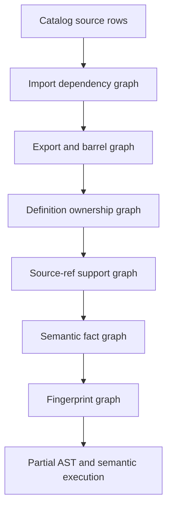
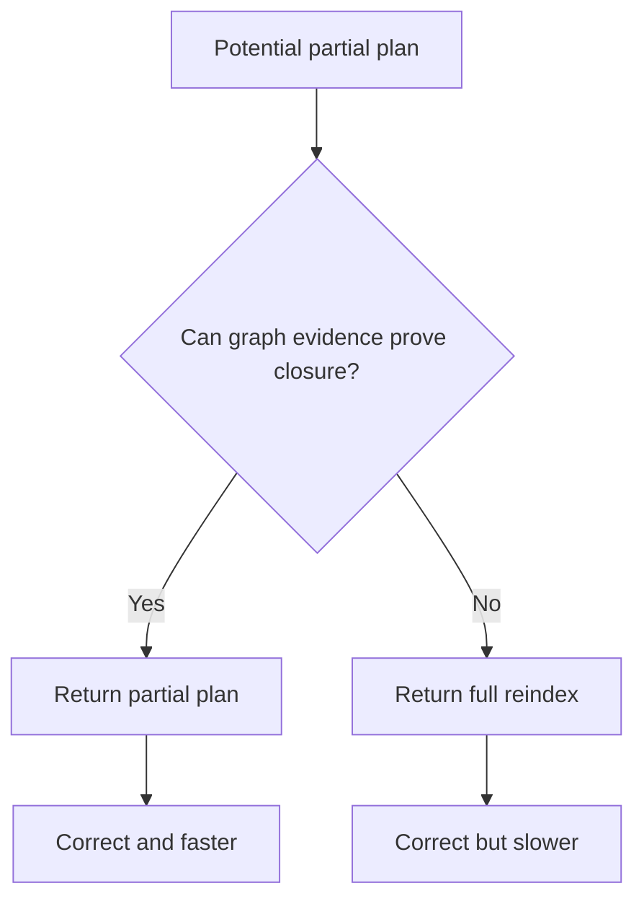
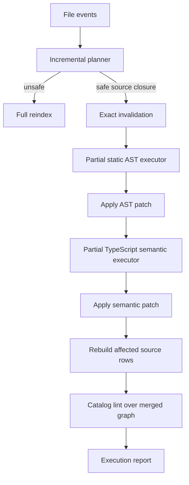

# @crux/source-indexer Architecture

`@crux/source-indexer` turns authored project source into the Project Catalog facts served by
`@crux/local`. It owns static source discovery, semantic enrichment, source references, catalog
relations, catalog lint facts, and the source graph read model used to explain authored Crux systems.

The package should stay correctness-first: when source graph evidence is incomplete, stale, or
ambiguous, indexing must fall back to a full project reindex instead of publishing a partial catalog
that might omit affected facts.

## Current Pipeline

The public package entry points are intentionally small:

- `indexProject(...)` creates a complete catalog snapshot.
- `indexProjectAst(...)` produces AST patch facts.
- `indexProjectSemantic(...)` produces semantic patch facts.
- `indexProjectIncremental(...)` consumes the incremental planner and produces ordered AST/semantic
  catalog patches, falling back to full indexing when graph evidence is unsafe.
- `runProjectIndexingSession(...)` exposes the full session boundary for tests and worker
  orchestration.

## Experimental Extension Boundary

The Project Catalog Compiler has an experimental Source Indexer Extension boundary. The boundary uses
role-based compiler slots instead of exposing internal execution/cache phase names as API:

V1 wires current first-party static extractors through the extension registry while preserving the
stable `indexProject*` entry points. Normal extractors should emit immutable intermediate facts,
unresolved references, source refs, diagnostics, and dependency declarations. Resolver slots link
unresolved references into validated Project Catalog relations after definitions are known. Rules run
over resolved catalog facts. Emitters remain compiler-internal and produce snapshots, patches, source
rows, and reports.

The boundary is intentionally pure-functional at the slot level: extensions return values, and the
compiler owns validation, merge order, source graph projection, cache keys, patch invalidation, and
full reindex fallback. The executable boundary for this model should be an Extension Runtime: a
compiler-owned functional module that normalizes Source Indexer Extension manifests, records
deterministic contribution identity, runs compiler slot contributions, and returns immutable result
objects. The runtime must not be a mutable plugin manager or global registry service.

First-party static extractors now emit immutable `ExtractedFacts` through the extension registry, and
the parser projects those facts into the current catalog snapshot/patch contracts. The next
structural step is to move registry normalization, static extractor dispatch, TypeScript-to-context
adaptation, result/degraded diagnostics policy, compatibility projection, and runtime cache identity
behind the Extension Runtime so `static-parser.ts` only finds parser-owned candidate source shapes and
asks the runtime to execute extension contributions. Some first-party helpers still use an unstable
compiler-owned native context for traversal-heavy TypeScript inspection. Raw TypeScript nodes are not
a stable extension API.

The stable static extractor context now has enough shared preparation for current first-party static
compiler work: `ctx.args` for factory arguments, `ctx.config` for object-literal/static JSON/schema
projection, and `ctx.sourceRef` for property, callback, schema, template interpolation, and helper
source refs. Prompt, context, tool, agent, composition, memory, routing, eval, flow, RAG, safety,
workspace, and scorer discovery are registered through `cruxCoreExtension`. Traversal-heavy modules
use internal unstable helpers that complement the extension boundary without becoming a public visitor
API.

The `@crux/source-indexer/extensions` subpath is experimental. It is documented so first-party
internals and tests can use the same shape that future external extension loading may adopt, but it
does not yet promise stable third-party plugin support.

### Extension Runtime

The Extension Runtime is the functional execution boundary for Source Indexer Extensions. It lives
behind internal compiler imports and keeps the public experimental extension authoring barrel focused
on authoring helpers rather than runtime control.

The runtime is functional and value-oriented:

- Inputs are readonly compiler views, extension manifests, and fact packets.
- Outputs are discriminated runtime results, diagnostics, dependency declarations, and immutable
  facts.
- Runtime manifests expose deterministic extension/extractor identities and cache inputs.
- No extension code receives graph builders, cache handles, mutable diagnostics arrays, or stable raw
  TypeScript AST APIs.
- Existing compatibility helpers delegate to the runtime during migration, but the runtime is the
  architectural boundary for slot execution.

The first runtime implementation is behavior-preserving and scoped to static extraction plus
runtime-adjacent compatibility helpers:

- `extractStatic(...)` runs static extractor contributions and returns `no-match`, `none`, `matched`,
  or `degraded` results.
- `staticFoundDefinitionFromStaticExtractionResult(...)` projects runtime facts into the current
  static parser compatibility shape.
- `resolveExtensionReferences(...)` exposes the built-in static reference resolver as a functional
  boundary without stabilizing public resolver authoring.
- `checkRules(...)` runs internal catalog rule contributions in deterministic extension/rule order.

The runtime does not pull semantic enrichment, incremental execution, source resolver behavior, or
public third-party extension loading into this refactor.

## Source Resolver Boundary

The source resolver is part of this package because it needs to run near local project artifacts, but
it is not part of Project Catalog indexing. It supports runtime trace and span inspection in
devtools:

This boundary should stay distinct from `project-indexer.mjs`:

- Project indexing is ahead-of-time catalog construction over authored project files.
- Source resolution is lazy runtime lookup from bundled file, line, and column positions.
- Catalog source refs can enrich project intelligence, but they do not replace source-map lookup for
  bundled runtime frames.

The stable import remains `@crux/source-indexer/source-resolver`. Internally, the implementation is
organized as a small stateful facade over pure functional modules:

- `source-resolver/filesystem.ts`: injected filesystem effects.
- `source-resolver/discovery.ts`: source-map discovery and path normalization.
- `source-resolver/trace-map.ts`: trace-map parsing and original position lookup.
- `source-resolver/original-source.ts`: `sourcesContent` and disk fallback loading.
- `source-resolver/extraction.ts`: function-like source extraction.
- `source-resolver/cache.ts`: cache keys, limits, and eviction policy.
- `source-resolver/protocol.ts`: JSON-line worker request parsing and response serialization.
- `source-resolver/resolver.ts`: `SourceResolver` compatibility facade.

The facade may hold cache state for runtime efficiency. Helper modules should remain documented,
mostly pure, and directly testable.

## Source Graph Read Model

The durable graph currently exposed to callers is `ProjectCatalogSnapshot.sources`. Each
`CatalogSourceFile` row records:

- `file`: the authored source path.
- `definitionIds`: catalog definitions produced by the file.
- `dependencies`: source files this file imports or references.
- `dependents`: source files that depend on this file.
- `diagnostics`: indexer diagnostics attached to the file.

This read model is intentionally plain JSON so it can cross the TypeScript worker and Go runtime
boundary. Internally, `indexer/graph` uses branded IDs and maps to construct the richer graph before
projecting it back into catalog source rows.

## Incremental Planner and Executor

Incremental indexing is split into a pure planner and an executor. The planner decides what a file
change would affect. The executor either turns planner-approved closures into exact-invalidation
patches or delegates unsafe decisions to the existing full indexing paths.

The planner exists to establish the same invariant used by compilers and build systems:

> A partial plan is allowed only when the graph can explain the affected closure. Otherwise the
> planner must request a full reindex.

The current implementation uses `previousCatalog.sources` as graph evidence. Later work may add richer
graph evidence without changing the high-level planner contract.

## Planned Incremental Layers

The planner should scale by improving graph evidence in layers:

1. **Catalog source rows**: existing durable graph rows in `previousCatalog.sources`.
2. **Import dependency graph**: static import edges, including path aliases when the resolver proves
   the target.
3. **Export and barrel graph**: edges that distinguish re-export files from definition-owning files.
4. **Definition ownership graph**: mapping of definitions to producing and contributing files.
5. **Source-ref support graph**: schema, callback, template, and helper source references that
   contribute metadata without always producing definitions.
6. **Semantic fact graph**: TypeScript-resolved aliases, schemas, callbacks, and relation facts.
7. **Fingerprint graph**: content and config hashes that support reusing cached facts.

Each layer should be additive. Missing evidence at any layer reduces optimization, not correctness.

## Planner Decisions

Planner decisions should be a discriminated union with stable reason codes. The exact TypeScript
names can evolve, but the architecture should preserve these categories:

- `full-reindex-required`: graph evidence is missing, ambiguous, stale, or a broad boundary changed.
- `source-file-reindex`: changed files are known leaves with locally owned catalog facts.
- `dependency-closure-reindex`: changed files affect known dependents through the reverse source graph.
- `semantic-closure-reindex`: typed vocabulary for future source-ref or checker-backed facts that
  require semantic enrichment; defined and explainable before it is emitted.
- `noop`: future category for changes proven irrelevant to catalog output.

Every decision should include normalized changed files, affected files, affected definition IDs when
known, graph confidence, and an explanation payload suitable for worker logs.

`semantic-closure-reindex` remains reserved planner vocabulary. Current semantic partial execution is
file-closure based: it enriches known catalog-owning files and semantic source-ref support rows inside
planner-approved AST closures. Checker-only closure decisions should still fall back until durable
semantic graph evidence can prove the affected set.

`noop` is documented as a future category only. The first planner implementation should not emit it
because a false no-op can silently preserve stale catalog facts.

## Safety Gates

The planner must return `full-reindex-required` when any of these conditions apply:

- No previous catalog is available.
- The previous catalog has no source rows or no dependency/dependent evidence.
- A config, compiler, package manifest, or lockfile changed.
- A changed source file is not represented in the previous graph.
- A dependency target cannot be resolved with confidence.
- A deleted file cannot be mapped back to previous graph ownership.
- The affected closure exceeds a configured budget.
- The graph contains unresolved import diagnostics relevant to the changed files.

Dynamic imports, side-effect imports, path alias oddities, generated files, deleted files, and config
changes are reliability hazards only if treated optimistically. The intended behavior is conservative:
fallback first, optimize later when graph evidence can prove the affected closure.

## Proven Architecture Basis

The planner should follow established incremental architecture rather than invent a Crux-specific
shortcut.

| System                                               | Architecture lesson                                                                                          | Crux equivalent                                                                         |
| ---------------------------------------------------- | ------------------------------------------------------------------------------------------------------------ | --------------------------------------------------------------------------------------- |
| TypeScript project references and incremental builds | Persist graph/build metadata and explain up-to-date decisions separately from compilation.                   | Use catalog source rows as graph metadata, then execute indexing in later phases.       |
| Bazel Skyframe                                       | Invalidate reverse dependencies from changed inputs; undeclared dependencies make incremental reuse unsound. | Walk `dependents` from changed files and fall back when dependencies are not declared.  |
| rustc query system                                   | Track query dependencies and fingerprints so unchanged facts can stay green.                                 | Future static, semantic, and lint facts can become independently reusable graph facts.  |
| ESLint cache                                         | Separate changed-file classification and cache strategy from lint execution.                                 | Keep file classification and invalidation planning separate from AST/semantic indexing. |
| Nx and Turborepo                                     | Use explicit project/task graphs to compute affected work before executing tasks.                            | Compute affected source/catalog work before partial index workers run.                  |

## Testing Strategy

Planner work should use vertical TDD slices through the public planner interface:

1. Missing graph data returns a full reindex decision.
2. A known source leaf returns a source-file plan.
3. A changed dependency walks reverse dependents deterministically.
4. Config and compiler boundary changes return full reindex.
5. Unknown or deleted files return full reindex unless previous ownership is provable.
6. Explanation generation handles every decision kind exhaustively.

Tests should verify behavior through public planner functions, not private traversal helpers. Type-level
tests or `never` exhaustiveness checks should protect discriminated-union handling.

## Implementation Boundaries

The incremental planner is not the incremental executor. Planner modules stay pure and explainable;
executor modules own analyzer calls, patch construction, fallback routing, and execution reports.

The Go runtime remains the read-model owner. The `project-indexer.mjs` worker exposes
`indexProjectIncremental`; `@crux/local` can call it with a previous catalog plus changed/deleted
files, then apply the returned ordered patches through the same catalog patch state used by AST and
semantic refreshes.

## Incremental Execution Architecture

The production execution phase wires the planner into an executor that keeps full indexing as the
reference implementation. Incremental execution is a smaller invalidated run through the same static
AST analyzers, TypeScript semantic analyzers, merge functions, lint analyzers, graph builder, and
patch application semantics.

The executor should follow proven incremental-system patterns:

| Proven system                 | Production lesson                                                                     | Crux execution rule                                                                                    |
| ----------------------------- | ------------------------------------------------------------------------------------- | ------------------------------------------------------------------------------------------------------ |
| TypeScript builder programs   | Reuse diagnostics/work only when changed files and cascading dependencies are known.  | Execute semantic work over the planner's affected closure first; consider builder-program reuse later. |
| Bazel Skyframe                | Reads outside the dependency graph break incremental correctness.                     | Every analyzer dependency must be recorded in query fingerprints or force fallback.                    |
| rustc/Salsa red-green queries | A changed input can still keep dependents reusable when its output is unchanged.      | Add output equality reuse after file-level partial execution is proven equivalent to full indexing.    |
| ESLint cache                  | Content-hash cache strategy is safer than mtime-only detection across git operations. | Fingerprint source/config content, not only file metadata.                                             |
| Turborepo                     | Cache hits require deterministic tasks with declared inputs and outputs.              | Model static, semantic, lint, and source-graph facts as deterministic query records.                   |

Initial query records should stay file-level:

- `StaticParse(file)`: source hash, parser/extractor version, config boundary hashes, resolved import
  target hashes -> definitions, relations, source refs, diagnostics, dependency edges.
- `SemanticAnalyze(file, analyzer)`: source hash, analyzer version, TypeScript version, compiler
  options hash, resolved module graph hash, static candidate hash -> semantic definition patches,
  relations, source refs, diagnostics.
- `CatalogLint(ruleProfile)`: merged definitions/relations/lint config/suppressions -> lint
  findings.
- `SourceGraph(component)`: affected rows, dependency edges, ownership maps -> normalized
  `CatalogSourceFile` rows and a trusted `sourceGraph` marker.

The executor must preserve these invariants:

- A partial patch must declare exact `invalidates.files` and `invalidates.definitionIds`.
- Patch application must remove stale file-owned, definition-owned, diagnostic, source-ref, relation,
  source-row, and lint facts before merging replacements.
- Go catalog patch application must honor exact invalidation before merge, including definitions,
  relations, diagnostics, lint findings, source rows, and phase ownership maps.
- Catalog-level lint runs after the partial static/semantic patches are merged because it depends on
  the merged graph.
- Source graph rows for affected files and direct neighbors are rebuilt together so dependency and
  dependent edges remain symmetric.
- If any analyzer reads unregistered input, any cache fingerprint is incomplete, or any graph marker
  capability cannot be preserved, the executor falls back to full reindex.

The rollout should begin in shadow mode: compute the partial patches, apply them to the previous
catalog state in memory, compare the normalized result to a full reindex in tests and diagnostic runs,
and publish partial results only after equivalence is stable across fixtures.

Implemented v1 behavior:

- `indexProjectIncremental({ mode: 'ast' })` emits exact-invalidation AST patches for
  `source-file-reindex` and `dependency-closure-reindex` decisions.
- `indexProjectIncremental({ mode: 'ast-and-semantic' })` emits the AST patch followed by semantic
  enrichment for known catalog-owning source files and semantic source-ref support files in the
  affected closure.
- Unsafe plans, old snapshots, unknown files, config changes, unsupported semantic closures, and
  incomplete graph evidence fall back to full indexing.
- Safe deleted leaf files emit invalidation-only AST patches.
- Execution reports are JSON-safe and include planner kind, fallback reason, affected files,
  affected definitions, parsed/analyzed files, invalidation, and cache counters.
- The devtools Go patch applier supports exact file/definition invalidation and source-row union
  merging, so runtime partial patches no longer require all-or-nothing invalidation.
- The local project index worker and devtools service have an incremental bridge. The service falls
  back to full reindex if no previous source graph or incremental-capable worker is available.

Known v1 boundary:

- First-run semantic support files, such as schema modules that have not yet been seen by semantic
  enrichment, are still `unknown-file` planner fallbacks. After semantic enrichment emits source-ref
  support rows, those files become durable graph nodes and can participate in partial semantic
  reindexing.
- HTTP/API delta triggering is wired through `POST /api/project/catalog/reindex` and
  `POST /api/catalog/reindex` when the request body includes `files` or `deletedFiles`.
- `crux dev` starts a Go `fsnotify` watcher after the initial full catalog reindex succeeds. The
  watcher recursively registers project directories, ignores generated/cache directories, debounces
  event bursts, coalesces changed/deleted file sets, and feeds a single-flight incremental reindex
  runner so catalog refreshes never overlap.

For the durable implementation checklist and slice-by-slice TDD plan, see
[docs/incremental-planner-execution-plan.md](./docs/incremental-planner-execution-plan.md).
