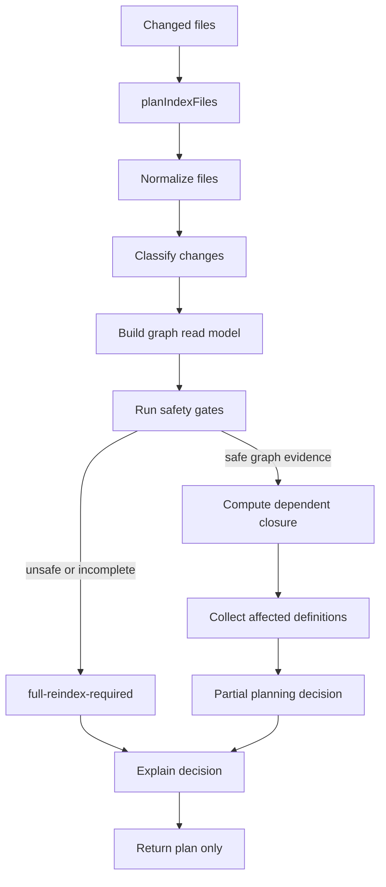
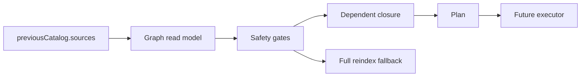
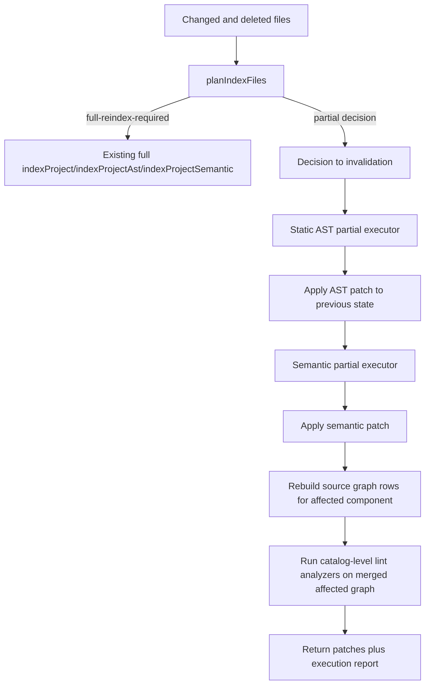

# Incremental Planner Execution Plan

This plan tracks issue `use-crux/crux#18`: replace the current always-full-reindex incremental
placeholder with a graph-backed, correctness-first planner boundary for `@crux/source-indexer`.

This is a durable handoff document. Keep it updated whenever decisions, scope, implementation slices,
tests, or documentation requirements change.

## Status

- Current phase: incremental execution v1 implemented for planner-approved source closures, with a
  Go runtime bridge for applying incremental patches to the live devtools catalog state.
- Current implementation behavior: `planIndexFiles(...)` returns explainable typed planning decisions
  based on previous catalog source graph evidence, with full reindex as the conservative fallback.
- Current execution behavior: `indexProjectIncremental(...)` consumes planner decisions and can emit
  exact-invalidation AST patches for `source-file-reindex` and `dependency-closure-reindex`.
  `ast-and-semantic` mode also emits semantic enrichment patches for known catalog-owning source
  files and semantic source-ref support files in the affected closure.
- Current runtime behavior: `project-indexer.mjs` accepts `indexProjectIncremental` worker requests,
  `@crux/local` exposes an incremental project-index worker/service path, and the Go catalog patch
  applier honors exact file/definition invalidation plus source-row union merging. The HTTP reindex
  endpoints call the incremental path when the request body includes `files` or `deletedFiles`.
- Remaining execution scope: first-run support files that do not yet have semantic source-ref support
  rows still fall back until semantic enrichment materializes durable graph evidence.

## Locked Decisions

- Build an **Incremental Planner** before building a partial indexing executor.
- Use `previousCatalog.sources` as the first durable **Graph Evidence** source.
- Partial plans are allowed only when graph evidence can prove the affected **Dependent Closure**.
- `full-reindex-required` is correct fallback behavior, not a planner failure.
- `semantic-closure-reindex` belongs in the planner vocabulary before semantic partial execution
  exists.
- Early `semantic-closure-reindex` decisions may still execute as full reindex until a later issue
  wires a safe semantic partial executor.
- `noop` remains a future decision category in architecture docs, but the first implementation must
  not emit it.
- Prefer pure functional modules: inputs in, immutable decision data out, no hidden mutable planner
  state.
- Add small focused files immediately instead of growing the existing large files.
- Public planner types and functions need proper JSDoc.

## Explicit Scope

In scope for issue #18:

- Keep `planIndexFiles(...)` as the public planner entry point.
- Introduce typed planner decisions with stable reason codes.
- Build a graph read model from `previousCatalog.sources`.
- Normalize, dedupe, and sort changed files deterministically.
- Classify changed files into known source, unknown source, config/compiler boundary, deleted known
  source, and unsupported/unsafe cases.
- Compute reverse dependent closure for known source files when graph evidence is sufficient.
- Collect affected file paths and affected definition IDs.
- Emit explainable decisions that worker logs can present without re-running planner internals.
- Preserve full reindex fallback for incomplete or unsafe graph evidence.
- Add focused behavior tests using TDD vertical slices.
- Update package docs, architecture docs, and public docs as needed.

Original planner-only out of scope for issue #18, later completed by the execution/runtime slices:

- Running partial AST indexing from the plan.
- Running partial semantic indexing from the plan.
- Changing Go worker orchestration or catalog patch application.

Still out of scope:

- Persisting a new cache format unless implementation proves `previousCatalog.sources` is
  insufficient.
- Building a persistent TypeScript language service or parsing `.tsbuildinfo`.
- Returning `noop` decisions.
- Optimistically handling dynamic imports, unresolved path aliases, side-effect imports, generated
  files, or ambiguous deleted files.

In scope for the next incremental execution phase:

- Add an execution adapter that consumes `IncrementalIndexDecision`.
- Reuse existing static and semantic cache facts only when the exact query inputs and boundary hashes
  match.
- Create partial AST patches for `source-file-reindex` and `dependency-closure-reindex`.
- Create partial semantic patches for the same affected file set once static facts have been merged.
- Apply exact invalidation before merging replacement facts.
- Remove facts owned by deleted files when deletion is proven safe by the previous source graph.
- Preserve full-reindex behavior for unsupported planner decisions, stale graph evidence, budget
  overflow, missing cache facts, or any patch equivalence failure in tests.
- Add full-vs-partial equivalence tests for static AST facts, semantic facts, lint findings, source
  graph rows, diagnostics, and catalog patch application.
- Add logs/metrics showing decision kind, invalidated files, reused file count, parsed file count,
  semantic file count, cache hit/miss counts, and fallback reason.

Implemented in incremental execution v1:

- `indexProjectIncremental(...)` public execution boundary.
- `ast` mode for exact-invalidation AST/source-only partial patches.
- `ast-and-semantic` mode for AST partial patches followed by semantic enrichment patches.
- Full AST fallback for unsafe planner decisions.
- Full AST + full semantic fallback for `ast-and-semantic` mode when the planner requires full
  reindex.
- Execution reports with plan kind, fallback, changed/deleted files, affected files/definitions,
  parsed/analyzed files, invalidation, cache miss counts, and duration buckets.
- Devtools worker bridge for incremental requests carrying previous catalog, changed files, deleted
  files, mode, and max affected file budget.
- Go read-model bridge that applies ordered incremental patches and falls back to full reindex when
  no previous source graph or incremental-capable worker is available.
- Go `fsnotify` watcher for `crux dev` that debounces source/config file changes, coalesces
  changed/deleted file sets, ignores generated/cache directories, and runs incremental reindex through
  a single-flight queue.
- Go catalog patch application for exact file/definition invalidation, partial diagnostic merging, and
  source-row union merging across AST/semantic phases.
- Semantic source-ref support rows so schema/helper files can become durable graph nodes after
  semantic enrichment.
- Semantic cache invalidation includes previously known source rows, so support-file edits participate
  in cache keys.
- Full-vs-partial equivalence tests for:
  - leaf source changes,
  - reverse dependency closure changes,
  - safe deleted leaf files,
  - TypeScript semantic analyzer owner-file changes,
  - schema/source-ref support-file changes after support rows exist,
  - conservative full fallback execution reports.

Out of scope for the next incremental execution phase:

- A long-lived TypeScript language service daemon.
- Parsing or depending on `.tsbuildinfo`.
- Fine-grained expression/query-level invalidation inside one source file.
- Incremental reparsing of TypeScript AST nodes inside an unchanged file.
- Emitting `noop`.
- Optimistic partial execution for dynamic imports, side-effect-only imports, unresolved aliases, or
  generated files without explicit graph evidence.

## Architecture Summary



The central invariant:

> A partial plan is valid only when the graph can explain every affected file and definition.
> Otherwise the planner must request a full reindex.

## Proven Architecture Basis

- TypeScript incremental builds: persist graph/build metadata, explain up-to-date decisions, and keep
  execution separate from invalidation planning.
- Bazel Skyframe: invalidate reverse dependencies from changed inputs; undeclared dependencies make
  incremental reuse unsound.
- rustc query system: track dependency edges and fingerprints so reusable facts can become green only
  when inputs prove unchanged.
- ESLint cache: separate file change classification/cache strategy from lint execution.
- Nx and Turborepo: compute affected work from explicit graphs before executing tasks.

Additional execution lessons from research:

- TypeScript `BuilderProgram` APIs cache diagnostics and emit results across builds when a file or
  cascading dependency has not changed. Crux should copy the shape, not the exact artifact: use the
  TypeScript compiler/checker for semantic fact extraction, but keep Crux-owned catalog fact caches
  as the durable execution cache.
- TypeScript's public incremental APIs can rehydrate old builder programs from `.tsbuildinfo`, but
  that file is compiler-output metadata, not a stable Crux catalog contract. Treat `.tsbuildinfo` as
  optional inspiration only.
- Skyframe's most important correctness rule is dependency registration: computations must request
  their inputs through the graph. Crux analyzers must therefore report every source/config dependency
  they read, or their facts are not safe for reuse.
- rustc and Salsa use red-green style reuse: if an invalidated input recomputes to an identical
  output, dependents can remain reusable. Crux should add this later as a refinement after file-level
  incremental execution is correct.
- ESLint exposes both metadata and content cache strategies. Crux should use content hashes for source
  files and config/compiler boundaries because git checkouts and generated file touches can change
  mtimes without changing catalog facts.
- Turborepo caches deterministic task outputs based on declared inputs and explicit outputs. Crux
  should model every reusable unit as a deterministic query with named inputs, named outputs, and a
  schema-versioned cache key.

Crux adaptation:



## Proposed File Structure

Create an `indexer/incremental/` directory and move the planner into small pure modules.

```text
indexer/
  incremental.ts
  incremental/
    types.ts
    paths.ts
    classify.ts
    graph-read-model.ts
    closure.ts
    decisions.ts
    explain.ts
    plan.ts
    index.ts
```

Suggested responsibilities:

- `incremental.ts`: compatibility re-export only. Keep imports stable for existing callers.
- `incremental/index.ts`: public exports for the incremental planner.
- `incremental/types.ts`: public planner interfaces, discriminated unions, branded path types, reason
  code types, graph confidence types.
- `incremental/paths.ts`: pure root/file normalization helpers.
- `incremental/classify.ts`: pure changed-file classification and broad-boundary detection.
- `incremental/graph-read-model.ts`: pure conversion from `ProjectCatalogSnapshot.sources` to lookup
  maps.
- `incremental/closure.ts`: pure reverse dependent closure traversal with deterministic output.
- `incremental/decisions.ts`: small constructors for valid decision objects.
- `incremental/explain.ts`: explanation payload and exhaustive formatting helpers.
- `incremental/plan.ts`: orchestration for `planIndexFiles(...)`.

Keep modules small. If one file grows past roughly 200 lines during implementation, pause and split
by responsibility before continuing.

For the next execution phase, extend the same directory structure instead of adding logic back to the
large top-level files:

```text
indexer/
  incremental/
    executor.ts
    execution-types.ts
    execution-report.ts
    invalidation.ts
    static-executor.ts
    semantic-executor.ts
    patch-builder.ts
    equivalence.ts
    fingerprints.ts
    cache-read-model.ts
```

Suggested responsibilities:

- `executor.ts`: public `indexProjectIncremental(...)` orchestration. It calls the planner, routes
  full decisions to existing full indexers, and routes supported partial decisions to static and
  semantic executors.
- `execution-types.ts`: discriminated unions for execution results, fallback reports, and cache
  provenance. Keep this separate from planner types so planning remains pure and reusable.
- `execution-report.ts`: JSON-safe log/metric payloads for worker output and future devtools UI.
- `invalidation.ts`: converts decisions into catalog patch invalidation and validates that the patch
  removes every owned fact before replacement facts are merged.
- `static-executor.ts`: produces source-only AST facts for affected files using the existing static
  parser/cache and graph builder.
- `semantic-executor.ts`: produces semantic facts for affected files after static facts are available.
- `patch-builder.ts`: creates phase-specific catalog patches with exact invalidation, source graph
  marker preservation, budgets, and timestamps.
- `equivalence.ts`: test helper that compares full reindex state with full baseline plus partial
  patches after normalizing timestamps/order.
- `fingerprints.ts`: content/config hash helpers used by both static and semantic cache keys.
- `cache-read-model.ts`: typed access to existing cache entries, cache schema versions, and reusable
  fact provenance.

## TypeScript Design

Use advanced TypeScript patterns deliberately but keep them shallow:

- Branded types for normalized absolute source paths so raw strings do not leak through traversal:

```ts
export type AbsoluteSourceFilePath = string & { readonly __brand: 'AbsoluteSourceFilePath' }
```

- Discriminated unions for planner decisions:

```ts
export type IncrementalIndexDecision =
  | FullReindexRequiredDecision
  | SourceFileReindexDecision
  | DependencyClosureReindexDecision
  | SemanticClosureReindexDecision
```

- Stable reason-code unions for logging and tests.
- `unknown` plus type guards at any untrusted serialized-data boundary.
- `readonly` arrays and records on public decision payloads.
- `never` exhaustiveness checks in `explain.ts`.
- No explicit `any`.
- Avoid deep type gymnastics that would slow compilation or make errors unreadable.

## JSDoc Requirements

Add JSDoc to every exported type and function in the new incremental planner modules.

JSDoc should explain:

- What correctness invariant the function or type protects.
- Whether a decision describes planning only or executable behavior.
- When full reindex fallback is expected.
- Whether a path must already be normalized.
- Any budget or confidence assumptions.

Example style:

```ts
/**
 * Computes the source files that may need catalog refresh after a file change.
 *
 * This is a planning-only API. It must return a full reindex decision whenever
 * previous catalog graph evidence cannot prove a complete affected closure.
 */
export function planIndexFiles(options: IndexFilesOptions): IncrementalIndexDecision
```

## Decision Model

Initial emitted decisions:

- `full-reindex-required`
- `source-file-reindex`
- `dependency-closure-reindex`

Defined and explained vocabulary, but not currently emitted:

- `semantic-closure-reindex`

Documented future-only decision:

- `noop`

`noop` should not be emitted until a later issue adds hard proof that a changed file cannot affect
catalog output.

Required common fields:

- `kind`
- `root`
- `changedFiles`
- `graphConfidence`
- `explanation`

Required partial-plan fields:

- `affectedFiles`
- `affectedDefinitionIds`

Required full-reindex fields:

- `reason`
- `previousCatalogDefinitionCount`
- `files`

Recommended graph confidence values:

- `complete-enough-for-source-closure`
- `missing-previous-catalog`
- `missing-source-graph`
- `missing-dependent-edges`
- `unknown-file`
- `config-or-resolver-changed`
- `unresolved-imports-present`
- `closure-budget-exceeded`

## Next-Phase Execution Model

The executor must be deliberately boring: decide, invalidate, recompute, patch, verify in tests. It
should not contain analyzer-specific heuristics.



Execution invariants:

- Full indexing remains the reference implementation.
- Partial execution must use the same analyzers and merge functions as full indexing.
- Every partial patch must include exact invalidation for affected files and definition IDs.
- A fact can be reused only if its query key records all source, dependency, analyzer, compiler, and
  config inputs that can affect it.
- Deleted files are safe only when previous graph ownership proves the deleted file had no dependents
  or the planner selected the complete dependent closure.
- Catalog-level lint facts must be recomputed after partial static and semantic facts are merged,
  because lint findings depend on the merged catalog graph, not just one file.
- Source graph rows for affected files and their direct neighbors must be rebuilt after replacement
  facts are merged so `dependencies` and `dependents` stay symmetric.

## Query/Fingerprint Model

Model reusable work as deterministic query records rather than ad hoc file cache blobs.

```text
StaticParse(file)
  inputs: source hash, parser version, extractor registry version, config boundary hashes,
          resolved static import target hashes
  outputs: definitions, relations, sourceRefs, diagnostics, source dependency edges

SemanticAnalyze(file, analyzer)
  inputs: source hash, analyzer version, TypeScript version, compiler options hash,
          resolved module graph hash, static candidate hash
  outputs: definition patches, relations, sourceRefs, lint-fact inputs, diagnostics

CatalogLint(ruleProfile)
  inputs: merged definitions hash, merged relations hash, lint config hash, suppressions hash
  outputs: lint findings

SourceGraph(component)
  inputs: affected source rows, dependency edges, definition ownership, diagnostic ownership
  outputs: normalized CatalogSourceFile rows plus sourceGraph marker
```

Initial implementation can keep cache storage simple and reuse the existing static/semantic caches,
but the execution boundary should be shaped around these query keys so later red-green reuse can be
added without rewriting the executor.

Required fingerprint inputs:

- Crux source-indexer cache schema version.
- Analyzer name and analyzer version.
- TypeScript package version for semantic facts.
- Compiler options and module resolution settings derived from `tsconfig.json`/`jsconfig.json`.
- Content hash for the changed file.
- Content hashes for statically resolved imports used by that file.
- Config/package/lockfile boundary hashes.
- Previous source graph marker and capabilities.

## AST Static Analyzer Plan

Static execution should be the first partial executor because it already runs without importing user
config modules and produces most durable ownership facts.

Slices:

1. Add `indexProjectAstPartial(options)` behind the incremental executor, not as a public root API at
   first.
2. Accept normalized `affectedFiles` from the planner and parse only those files.
3. Reuse `parseStaticDefinitionsCached(...)` when fingerprint input matches.
4. Produce a source-only `CatalogPatch` with exact invalidation for affected files and definition IDs.
5. Include source dependency edges discovered while parsing the affected files.
6. Rebuild source rows for affected files and direct dependency/dependent neighbors so reverse edges
   remain symmetric.
7. For deleted files, emit an invalidation-only AST patch when the planner proves safe deletion.
8. Fall back to full AST indexing when a parser dependency is unresolved, side-effect-only, dynamic,
   outside root, generated, too large, or outside the previous trusted source graph.

AST tests:

- Leaf source change reparses exactly one source file.
- Import target change reparses the target plus reverse dependents selected by the planner.
- Barrel export change falls back until export-specific graph evidence exists.
- Deleted leaf removes its definitions, diagnostics, relations, sourceRefs, lint findings, and source
  row.
- Partial AST patch applied to the previous catalog equals a full source-only reindex for supported
  fixtures.

## TypeScript Semantic Analyzer Plan

Semantic execution is trickier because facts can depend on checker resolution across files. Start with
file-level partial semantic execution over the planner's affected closure, not fine-grained symbol
queries.

Slices:

1. Add `semanticCatalogFactsForFiles(root, files, baseStaticFacts)` so semantic execution can analyze
   exactly the affected closure while using the same analyzer registry as full indexing.
2. Build one TypeScript `Program` for the affected closure plus compiler-required roots. Do not keep a
   daemon yet.
3. Record compiler options hash, TypeScript version, analyzer versions, and resolved module graph hash
   in semantic cache keys.
4. Recompute all semantic analyzers for affected files as one semantic patch.
5. Recompute catalog-level semantic lint after the affected semantic patch is merged with the previous
   catalog state.
6. Use a semantic budget separate from AST budget; overflow returns full semantic reindex or a
   degraded semantic patch only if the current public behavior already permits degradation.
7. Emit `semantic-closure-reindex` only after semantic source-ref ownership can prove which
   non-import files support a semantic fact.
8. Keep TypeScript builder-program integration as a later optimization. The first semantic executor
   can use `Program` per run while retaining query-style cache keys.

Semantic fallback conditions:

- Changed file has unresolved import diagnostics in the affected component.
- Compiler options or TypeScript version changed.
- Path alias resolution differs from the previous graph.
- A source ref points to a file outside the planner closure.
- Analyzer cache schema changed.
- Semantic patch would exceed budget.
- Any semantic analyzer reads a source file or symbol without recording that dependency.

Semantic tests:

- Schema/source-ref/relation/enrichment facts for affected files match full reindex.
- Callback/tool/agent relation changes invalidate dependent semantic facts.
- Path alias config changes full-reindex.
- TypeScript version/compiler option hash changes full-reindex or cache miss.
- Catalog lint findings are recomputed from merged partial state, not just affected files.

## Catalog Patch and State Plan

Partial execution becomes production-ready only when patch application is exact.

Required changes:

- Teach `applyCatalogPatch(...)` to remove facts by `invalidates.files` and
  `invalidates.definitionIds`, not only `invalidates.all`.
- Maintain ownership indexes in `CatalogPatchState`:
  - definition id -> owning file(s)
  - relation id -> contributing file(s)/definition id(s)
  - sourceRef id -> owning definition id and source file
  - diagnostic id -> owning file
  - lint finding id -> owning definition/relation ids when available
- Keep phase ownership maps so AST invalidation does not erase unrelated runtime/quality facts.
- Preserve source graph marker only when replacement source rows still satisfy all marker
  capabilities; otherwise clear it and force the next plan to full reindex.
- Add a patch validation helper that refuses partial patches with facts outside their declared
  invalidation closure.

Patch tests:

- Exact file invalidation removes all file-owned facts and keeps unrelated facts.
- Exact definition invalidation removes definition-owned semantic facts and dependent lint findings.
- Runtime and quality patches survive AST/semantic partial invalidation.
- Applying full patch and applying equivalent partial patches produce normalized equal state.

## Observability and Rollout Plan

The first production rollout should make correctness visible before optimizing further.

Execution report fields:

- `planKind`
- `fallbackReason`
- `graphConfidence`
- `changedFiles`
- `deletedFiles`
- `affectedFiles`
- `affectedDefinitionIds`
- `staticParsedFiles`
- `staticCacheHits`
- `staticCacheMisses`
- `semanticAnalyzedFiles`
- `semanticCacheHits`
- `semanticCacheMisses`
- `invalidatedFiles`
- `invalidatedDefinitionIds`
- `durationMsByPhase`

Rollout gates:

1. Keep full reindex as default while partial execution runs in test/diagnostic mode.
2. Add fixture equivalence tests and property-style mutation tests around representative Crux
   projects.
3. Enable partial AST execution first.
4. Enable partial semantic execution after AST patch equivalence is stable.
5. Add devtools display of planner/executor reports so users can see why indexing fell back.
6. Later, add red-green output comparison to avoid recomputing dependents when a changed input
   produces identical static/semantic facts.

## Next-Phase TDD Slices

1. Red: `applyCatalogPatch` exact file invalidation test. Green: remove file-owned facts using current
   ownership evidence. Status: complete.
2. Red: AST partial leaf equivalence test. Green: `indexProjectAstPartial` parses one file and emits
   exact invalidation. Status: complete.
3. Red: AST reverse-closure equivalence test. Green: executor consumes
   `dependency-closure-reindex`. Status: complete.
4. Red: deleted leaf equivalence test. Green: invalidation-only AST patch for safe deletion. Status:
   complete.
5. Red: semantic partial owner-file equivalence test. Green: semantic executor analyzes affected
   catalog-owning files and emits enrichment patches after AST patches. Status: complete.
6. Red: catalog lint recompute-after-merge test. Green: AST partial patches emit profile-filtered
   lint findings for replacement definitions; semantic catalog lints merge through semantic facts.
   Status: complete for owner-file v1.
7. Red: source graph symmetry test after partial patch. Green: rebuild affected source rows and
   dependency rows with graph builder. Status: complete for affected closure v1.
8. Red: fallback observability test. Green: JSON-safe execution report for every full fallback.
   Status: complete.
9. Red: support-file semantic closure equivalence test for schema/source-ref changes. Green: materialize
   durable source-ref support rows so non-owning files can be planned safely. Status: complete.
10. Red: shadow-mode full-vs-partial report test. Green: diagnostic mode computes both and reports
    normalized equality without publishing partial state. Status: pending.
11. Red: Go catalog patch exact invalidation/source-row merge tests. Green: remove stale file-owned
    facts, merge partial diagnostics by id, and union source row evidence. Status: complete.
12. Red: local worker/service incremental bridge tests. Green: `ProjectIndexWorker` round-trips
    incremental requests and `devtools.Service` applies ordered patches or falls back to full reindex.
    Status: complete.
13. Red: filesystem watcher/coalescer tests. Green: pure filters/coalescing/queue transitions plus
    `fsnotify` event classification; `crux dev` starts the watcher after startup full reindex.
    Status: complete.
14. Refactor: split any executor module over roughly 200 lines and add JSDoc to every exported
    function/type. Status: ongoing.

## Safety Gates

Return `full-reindex-required` when:

- `previousCatalog` is missing.
- `previousCatalog.sources` is empty.
- No source row has dependency/dependent evidence.
- Any changed file is a broad boundary:
  - `crux.config.ts`
  - `crux.config.mts`
  - `tsconfig.json`
  - `jsconfig.json`
  - `package.json`
  - `pnpm-lock.yaml`
  - `package-lock.json`
  - `yarn.lock`
  - `.gitmodules`
- Any changed file is unknown to the previous graph and not proven irrelevant.
- A changed file was deleted and cannot be mapped to previous source ownership.
- The dependent closure exceeds a conservative budget.
- Relevant diagnostics indicate unresolved imports in the affected component.

Dynamic imports, side-effect imports, path alias oddities, generated files, deleted files, and config
changes should fall back conservatively unless graph evidence can prove scope.

## TDD Execution Plan

Use vertical red-green-refactor slices. Do not write all tests first.

### Slice 1: Preserve Existing Fallback

Status: complete.

Behavior:

- Missing or graphless catalog returns `full-reindex-required`.
- File normalization remains deduped and sorted.

Test first:

- Existing `plans file-delta indexing as an explicit full reindex...` behavior still passes, with any
  expected payload updates made intentionally.

Implementation:

- Add minimal `types.ts`, `paths.ts`, `decisions.ts`, and `plan.ts`.
- Keep `indexer/incremental.ts` as a re-export/compatibility shell.

Verification:

- `pnpm --filter @crux/source-indexer test -- --run`

### Slice 2: Build Graph Read Model

Status: complete.

Behavior:

- Given previous catalog source rows, build deterministic maps for source, dependencies, dependents,
  and definition IDs.

Test first:

- Public planner behavior with a graph containing one known leaf source returns a non-full plan.

Implementation:

- Add `graph-read-model.ts`.
- Do not expose raw mutable maps unless needed internally.

Verification:

- Scoped tests for `@crux/source-indexer`.

### Slice 3: Known Leaf Source Plan

Status: complete.

Behavior:

- A changed known source with no dependents returns `source-file-reindex`.
- Affected files contain only the changed file.
- Affected definition IDs come from the source row.

Test first:

- Use a small in-memory `ProjectCatalogSnapshot` fixture; avoid invoking full `indexProject` unless
  needed for behavioral confidence.

Implementation:

- Add decision constructor and explain payload.

Verification:

- Scoped tests.

### Slice 4: Reverse Dependent Closure

Status: complete.

Behavior:

- A changed dependency walks dependents transitively and returns `dependency-closure-reindex`.
- Output order is deterministic.
- Cycles are handled without infinite traversal.

Test first:

- Graph A depends on B, B depends on C; changing C affects C, B, A.
- Graph cycle A <-> B terminates and includes both.

Implementation:

- Add `closure.ts`.
- Use pure queue traversal over readonly graph data.

Verification:

- Scoped tests.

### Slice 5: Safety Gates

Status: complete.

Behavior:

- Config/compiler/package boundary changes return full reindex.
- Unknown changed files return full reindex.
- Closure budget overflow returns full reindex.
- Unresolved import diagnostics in the affected component return full reindex.

Test first:

- One test per safety category, each through `planIndexFiles(...)`.

Implementation:

- Add `classify.ts` and safety gate orchestration.

Verification:

- Scoped tests.

### Slice 6: Semantic Vocabulary Without Execution

Status: complete as typed/explained vocabulary. The planner does not currently emit
`semantic-closure-reindex`.

Behavior:

- Planner can return or describe `semantic-closure-reindex` only when it has conservative evidence.
- No execution behavior changes.
- Explanation clearly says semantic partial execution is not implied.

Test first:

- A source-ref/checker-backed scenario should either return `semantic-closure-reindex` as plan-only or
  full reindex if evidence is insufficient. Prefer full reindex unless the existing catalog graph has
  enough source-ref data.

Implementation:

- Keep minimal. This may be documentation/types-only in first implementation if no safe evidence is
  available.

Verification:

- Scoped tests and typecheck.

### Slice 7: Exhaustive Explanation

Status: complete.

Behavior:

- `explainIncrementalDecision(...)` handles every emitted decision kind.
- Adding a new decision kind breaks typecheck until explanation is updated.

Test first:

- Runtime snapshots for explanation payloads.
- Compile-time `never` exhaustiveness in code.

Implementation:

- Add `explain.ts`.

Verification:

- `turbo typecheck --filter=@crux/source-indexer`
- Scoped tests.

## Documentation Checklist

Update docs during implementation, not at the end:

- [x] `packages/source-indexer/ARCHITECTURE.md` exists.
- [x] `packages/source-indexer/CONTEXT.md` captures resolved domain terms.
- [x] ADR records planner-before-executor decision.
- [x] README links architecture docs.
- [x] Keep this execution plan updated after each implementation slice.
- [x] Update `ARCHITECTURE.md` if actual module names, decision kinds, or safety gates change.
- [ ] Update `CONTEXT.md` if new durable domain terms are introduced.
- [ ] Update ADR or add a new ADR only for hard-to-reverse, surprising tradeoffs.
- [ ] Update `packages/core/README.md`, `packages/core/ARCHITECTURE.md`, and docs MDX only if public
  `@crux/core/catalog` contracts change.
- [x] Update source-indexer README if public entry points, cache semantics, or developer workflow
  change.

## Verification Commands

Run from `crux/` with WSL Node 24:

```bash
export PATH="$HOME/.nvm/versions/node/v24.16.0/bin:$PATH"
pnpm --filter @crux/source-indexer test -- --run
pnpm exec turbo typecheck --filter=@crux/source-indexer
```

If public `@crux/core/catalog` contracts change, also run:

```bash
pnpm exec turbo typecheck --filter=@crux/core
pnpm --filter @crux/core test -- --run
```

## Open Questions

- Should `ProjectCatalogSnapshot.sources` grow a version or confidence field, or is planner-local
  confidence enough for issue #18?
- Should deleted known files invalidate only their previous dependent closure, or should deletion
  always full reindex until barrel/export ownership is richer?
- What closure budget should trigger full reindex for large projects?
- Should config boundary detection live only in the planner or share constants with cache key logic?

Resolved:

- Unresolved import diagnostics disable partial planning for the affected component only, not globally.

## Current Next Step

Next implementation issue:

Complete the pre-execution readiness work below. This prepares the repository for actual incremental
index execution without wiring partial AST or semantic workers yet.

## Pre-Execution Readiness Plan

This section defines everything needed before a later issue can safely implement actual incremental
indexing. The goal is to make partial execution boring: once this readiness work is complete, the next
issue should mostly connect already-tested contracts.

Do not wire partial AST or semantic execution in this phase.

### Readiness 1: Plan-To-Patch Invalidation Contract

Status: complete.

Problem:

- `CatalogPatch` already supports `invalidates.files`, `invalidates.definitionIds`, and
  `invalidates.all`, but planner decisions do not yet have a tested adapter that converts a plan into
  those invalidation fields.

Deliverables:

- Add a pure adapter such as `catalogInvalidationFromDecision(decision)`.
- Full reindex decisions must produce `{ all: true }`.
- Source and dependency closure decisions must produce exact `files` and `definitionIds`.
- Semantic closure vocabulary must either produce exact invalidations or explicitly mark itself as
  execution-unsafe until semantic execution exists.
- Add tests that apply the adapter to every decision kind.

Exit criteria:

- A future AST executor can consume a planner decision without inventing invalidation semantics.

### Readiness 2: Patch Equivalence Harness

Status: complete.

Problem:

- Before executing partial patches, we need a test harness that can compare a hypothetical partial
  patch flow against a full reindex snapshot.

Deliverables:

- Add test helpers that:
  - build a baseline full snapshot,
  - apply one or more patches with `applyCatalogPatch(...)`,
  - serialize or normalize the resulting state,
  - compare it to a fresh full snapshot.
- Normalize non-semantic fields such as timestamps and indexing status before comparison.
- Keep this as test infrastructure only; no production execution path yet.

Exit criteria:

- Future incremental execution tests can prove "partial result equals full result" without bespoke
  assertions per feature.

### Readiness 3: Deleted-File Semantics

Status: complete.

Problem:

- Changed-file notifications may include deleted files. A deleted file can be known from
  `previousCatalog.sources`, but the current planner cannot prove whether deleting it affects barrels,
  config exports, or source-ref contributors.

Recommended policy:

- If the deleted file is unknown: full reindex.
- If the deleted file is known and has no dependents, no dependencies, and only owns definitions that
  can be invalidated exactly: allow a plan-only source invalidation.
- Otherwise full reindex until export/barrel ownership is richer.

Deliverables:

- Add `deletedFiles?: readonly string[]` or an explicit changed-file event shape to planner input.
- Add decision reasons for deleted-file fallback and exact deleted-file invalidation.
- Add tests for unknown deleted file, known leaf deleted file, and known dependent deleted file.

Exit criteria:

- Future file watcher integration can pass delete events without guessing.

### Readiness 4: Graph Evidence Version And Completeness

Status: complete.

Problem:

- The planner currently infers graph confidence from source rows. Before execution, we need a stable
  way to know whether a previous snapshot was produced by an indexer version that materialized the
  graph fields the executor relies on.

Recommended policy:

- Prefer planner-local confidence for issue #18.
- Before execution, add a durable graph evidence marker if needed. Options:
  - `ProjectCatalogSnapshot.indexing` metadata,
  - a source-indexer-owned source diagnostic/capability marker,
  - or a new public catalog field if the contract truly needs it.

Deliverables:

- Decide whether this requires a public `@crux/core/catalog` contract change.
- If public, update `packages/core/README.md`, `packages/core/ARCHITECTURE.md`, and docs MDX.
- Add migration/cache-version notes if stale Go catalog cache snapshots could hide the marker.
- Add tests proving old snapshots fall back.

Implementation note:

- `ProjectCatalogSnapshot.sourceGraph` is now the durable marker.
- Go store/API catalog structs preserve `sourceGraph`, source dependencies, and source dependents.
- Old snapshots without the marker fall back to full reindex.

Exit criteria:

- Future execution only trusts snapshots known to contain the required graph evidence.

### Readiness 5: Config Boundary Constants Shared With Cache Inputs

Status: complete.

Problem:

- Planner config-boundary detection and cache key config inputs are currently separate ideas. Actual
  incremental execution should not drift from cache invalidation.

Deliverables:

- Extract shared constants or helper functions for broad project boundary files.
- Include relevant config files used by static and semantic cache keys.
- Add tests that planner boundary files and cache boundary files stay aligned.

Exit criteria:

- Future partial execution cannot accidentally reuse facts across config/compiler boundary changes.

### Readiness 6: Planner Dry-Run Worker Contract

Status: complete.

Problem:

- Go and worker orchestration need a stable way to ask "what would incremental indexing do?" before
  actually doing it.

Deliverables:

- Add a TypeScript worker-facing function that returns planner decisions as JSON-safe data.
- Do not run partial indexing.
- Ensure decision payloads contain no `Map`, branded-only runtime values, or non-JSON data.
- Add schema or runtime guards if this crosses a process boundary.

Exit criteria:

- The Go runtime can log or expose incremental planner decisions without changing catalog state.

### Readiness 7: Execution Budgets And Fallback Policy

Status: complete.

Problem:

- The planner has a default closure budget, but production execution needs documented policy for
  budget values and fallback behavior.

Deliverables:

- Decide default `maxAffectedFiles` for local dev.
- Decide whether budget should be configurable.
- Add tests for boundary values.
- Document that budget overflow is full reindex fallback, not degraded partial output.

Exit criteria:

- Future execution has explicit limits and does not invent budget policy in worker code.

### Readiness 8: Public Explanation And Diagnostics Contract

Status: complete.

Problem:

- Decisions have explanations, but future devtools and CLI surfaces will need stable wording or
  structured fields.

Deliverables:

- Decide which fields are stable machine contract and which are human text.
- Add JSON snapshot tests for decision payloads.
- Keep human explanation strings separate from machine reason codes.

Exit criteria:

- Future UI/CLI integration can show planner decisions without depending on fragile strings.

### Readiness 9: Fixture Matrix For Real Crux Patterns

Status: complete for initial direct-import planner readiness.

Problem:

- Current planner tests use small synthetic source rows. Before execution, we need fixture coverage
  for real Crux graph shapes.

Deliverables:

- Add planner-only fixtures or integration tests for:
  - direct prompt import,
  - barrel export,
  - agent depending on prompt/tool/context,
  - flow step graph,
  - schema source ref,
  - unresolved import fallback,
  - generated/ignored file fallback or exclusion,
  - config boundary fallback.
- Tests should still call the public planner interface.

Exit criteria:

- Future execution work can rely on planner coverage for real authored patterns.

### Readiness 10: Documentation Completion Gate

Status: complete.

Problem:

- Incremental indexing will span planner, patches, worker orchestration, caches, and Go catalog state.
  Docs need to explain the boundary before execution code lands.

Deliverables:

- Update `ARCHITECTURE.md` with:
  - plan-to-patch invalidation,
  - dry-run worker contract,
  - graph evidence version/completeness policy,
  - equivalence harness.
- Keep this execution plan current after each readiness item.
- Add ADRs only if a readiness decision is hard to reverse, surprising, and trade-off-heavy.

Exit criteria:

- A future implementer can start actual incremental execution with no hidden architecture decisions.
