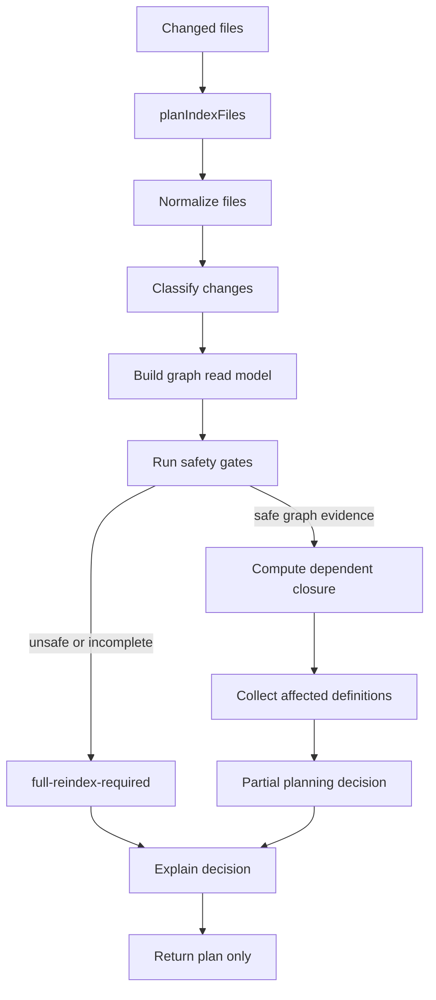
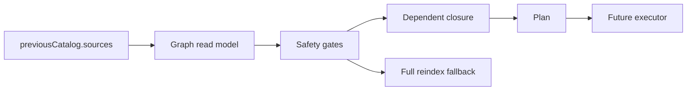

# Incremental Planner Execution Plan

This plan tracks issue `use-crux/crux#18`: replace the current always-full-reindex incremental
placeholder with a graph-backed, correctness-first planner boundary for `@crux/source-indexer`.

This is a durable handoff document. Keep it updated whenever decisions, scope, implementation slices,
tests, or documentation requirements change.

## Status

- Current phase: planning complete, implementation not started.
- Current implementation behavior: `indexer/incremental.ts` always returns
  `full-reindex-required` with reason `dependency-graph-not-materialized`.
- Target behavior: `planIndexFiles(...)` returns explainable typed planning decisions based on
  previous catalog source graph evidence, with full reindex as the conservative fallback.

## Locked Decisions

- Build an **Incremental Planner** before building a partial indexing executor.
- Use `previousCatalog.sources` as the first durable **Graph Evidence** source.
- Partial plans are allowed only when graph evidence can prove the affected **Dependent Closure**.
- `full-reindex-required` is correct fallback behavior, not a planner failure.
- `semantic-closure-reindex` belongs in the planner vocabulary before semantic partial execution
  exists.
- Early `semantic-closure-reindex` decisions may still execute as full reindex until a later issue
  wires a safe semantic partial executor.
- `noop` remains a future decision category in architecture docs, but the first implementation must
  not emit it.
- Prefer pure functional modules: inputs in, immutable decision data out, no hidden mutable planner
  state.
- Add small focused files immediately instead of growing the existing large files.
- Public planner types and functions need proper JSDoc.

## Explicit Scope

In scope for issue #18:

- Keep `planIndexFiles(...)` as the public planner entry point.
- Introduce typed planner decisions with stable reason codes.
- Build a graph read model from `previousCatalog.sources`.
- Normalize, dedupe, and sort changed files deterministically.
- Classify changed files into known source, unknown source, config/compiler boundary, deleted known
  source, and unsupported/unsafe cases.
- Compute reverse dependent closure for known source files when graph evidence is sufficient.
- Collect affected file paths and affected definition IDs.
- Emit explainable decisions that worker logs can present without re-running planner internals.
- Preserve full reindex fallback for incomplete or unsafe graph evidence.
- Add focused behavior tests using TDD vertical slices.
- Update package docs, architecture docs, and public docs as needed.

Out of scope for issue #18:

- Running partial AST indexing from the plan.
- Running partial semantic indexing from the plan.
- Changing Go worker orchestration or catalog patch application.
- Persisting a new cache format unless implementation proves `previousCatalog.sources` is
  insufficient.
- Building a persistent TypeScript language service or parsing `.tsbuildinfo`.
- Returning `noop` decisions.
- Optimistically handling dynamic imports, unresolved path aliases, side-effect imports, generated
  files, or ambiguous deleted files.

## Architecture Summary



The central invariant:

> A partial plan is valid only when the graph can explain every affected file and definition.
> Otherwise the planner must request a full reindex.

## Proven Architecture Basis

- TypeScript incremental builds: persist graph/build metadata, explain up-to-date decisions, and keep
  execution separate from invalidation planning.
- Bazel Skyframe: invalidate reverse dependencies from changed inputs; undeclared dependencies make
  incremental reuse unsound.
- rustc query system: track dependency edges and fingerprints so reusable facts can become green only
  when inputs prove unchanged.
- ESLint cache: separate file change classification/cache strategy from lint execution.
- Nx and Turborepo: compute affected work from explicit graphs before executing tasks.

Crux adaptation:



## Proposed File Structure

Create an `indexer/incremental/` directory and move the planner into small pure modules.

```text
indexer/
  incremental.ts
  incremental/
    types.ts
    paths.ts
    classify.ts
    graph-read-model.ts
    closure.ts
    decisions.ts
    explain.ts
    plan.ts
    index.ts
```

Suggested responsibilities:

- `incremental.ts`: compatibility re-export only. Keep imports stable for existing callers.
- `incremental/index.ts`: public exports for the incremental planner.
- `incremental/types.ts`: public planner interfaces, discriminated unions, branded path types, reason
  code types, graph confidence types.
- `incremental/paths.ts`: pure root/file normalization helpers.
- `incremental/classify.ts`: pure changed-file classification and broad-boundary detection.
- `incremental/graph-read-model.ts`: pure conversion from `ProjectCatalogSnapshot.sources` to lookup
  maps.
- `incremental/closure.ts`: pure reverse dependent closure traversal with deterministic output.
- `incremental/decisions.ts`: small constructors for valid decision objects.
- `incremental/explain.ts`: explanation payload and exhaustive formatting helpers.
- `incremental/plan.ts`: orchestration for `planIndexFiles(...)`.

Keep modules small. If one file grows past roughly 200 lines during implementation, pause and split
by responsibility before continuing.

## TypeScript Design

Use advanced TypeScript patterns deliberately but keep them shallow:

- Branded types for normalized absolute source paths so raw strings do not leak through traversal:

```ts
export type AbsoluteSourceFilePath = string & { readonly __brand: 'AbsoluteSourceFilePath' }
```

- Discriminated unions for planner decisions:

```ts
export type IncrementalIndexDecision =
  | FullReindexRequiredDecision
  | SourceFileReindexDecision
  | DependencyClosureReindexDecision
  | SemanticClosureReindexDecision
```

- Stable reason-code unions for logging and tests.
- `unknown` plus type guards at any untrusted serialized-data boundary.
- `readonly` arrays and records on public decision payloads.
- `never` exhaustiveness checks in `explain.ts`.
- No explicit `any`.
- Avoid deep type gymnastics that would slow compilation or make errors unreadable.

## JSDoc Requirements

Add JSDoc to every exported type and function in the new incremental planner modules.

JSDoc should explain:

- What correctness invariant the function or type protects.
- Whether a decision describes planning only or executable behavior.
- When full reindex fallback is expected.
- Whether a path must already be normalized.
- Any budget or confidence assumptions.

Example style:

```ts
/**
 * Computes the source files that may need catalog refresh after a file change.
 *
 * This is a planning-only API. It must return a full reindex decision whenever
 * previous catalog graph evidence cannot prove a complete affected closure.
 */
export function planIndexFiles(options: IndexFilesOptions): IncrementalIndexDecision
```

## Decision Model

Initial emitted decisions:

- `full-reindex-required`
- `source-file-reindex`
- `dependency-closure-reindex`
- `semantic-closure-reindex`

Documented future-only decision:

- `noop`

`noop` should not be emitted until a later issue adds hard proof that a changed file cannot affect
catalog output.

Required common fields:

- `kind`
- `root`
- `changedFiles`
- `graphConfidence`
- `explanation`

Required partial-plan fields:

- `affectedFiles`
- `affectedDefinitionIds`

Required full-reindex fields:

- `reason`
- `previousCatalogDefinitionCount`
- `files`

Recommended graph confidence values:

- `complete-enough-for-source-closure`
- `missing-previous-catalog`
- `missing-source-graph`
- `missing-dependent-edges`
- `unknown-file`
- `config-or-resolver-changed`
- `unresolved-imports-present`
- `closure-budget-exceeded`

## Safety Gates

Return `full-reindex-required` when:

- `previousCatalog` is missing.
- `previousCatalog.sources` is empty.
- No source row has dependency/dependent evidence.
- Any changed file is a broad boundary:
  - `crux.config.ts`
  - `crux.config.mts`
  - `tsconfig.json`
  - `jsconfig.json`
  - `package.json`
  - `pnpm-lock.yaml`
  - `package-lock.json`
  - `yarn.lock`
  - `.gitmodules`
- Any changed file is unknown to the previous graph and not proven irrelevant.
- A changed file was deleted and cannot be mapped to previous source ownership.
- The dependent closure exceeds a conservative budget.
- Relevant diagnostics indicate unresolved imports or partial graph construction.

Dynamic imports, side-effect imports, path alias oddities, generated files, deleted files, and config
changes should fall back conservatively unless graph evidence can prove scope.

## TDD Execution Plan

Use vertical red-green-refactor slices. Do not write all tests first.

### Slice 1: Preserve Existing Fallback

Behavior:

- Missing or graphless catalog returns `full-reindex-required`.
- File normalization remains deduped and sorted.

Test first:

- Existing `plans file-delta indexing as an explicit full reindex...` behavior still passes, with any
  expected payload updates made intentionally.

Implementation:

- Add minimal `types.ts`, `paths.ts`, `decisions.ts`, and `plan.ts`.
- Keep `indexer/incremental.ts` as a re-export/compatibility shell.

Verification:

- `pnpm --filter @crux/source-indexer test -- --run`

### Slice 2: Build Graph Read Model

Behavior:

- Given previous catalog source rows, build deterministic maps for source, dependencies, dependents,
  and definition IDs.

Test first:

- Public planner behavior with a graph containing one known leaf source returns a non-full plan.

Implementation:

- Add `graph-read-model.ts`.
- Do not expose raw mutable maps unless needed internally.

Verification:

- Scoped tests for `@crux/source-indexer`.

### Slice 3: Known Leaf Source Plan

Behavior:

- A changed known source with no dependents returns `source-file-reindex`.
- Affected files contain only the changed file.
- Affected definition IDs come from the source row.

Test first:

- Use a small in-memory `ProjectCatalogSnapshot` fixture; avoid invoking full `indexProject` unless
  needed for behavioral confidence.

Implementation:

- Add decision constructor and explain payload.

Verification:

- Scoped tests.

### Slice 4: Reverse Dependent Closure

Behavior:

- A changed dependency walks dependents transitively and returns `dependency-closure-reindex`.
- Output order is deterministic.
- Cycles are handled without infinite traversal.

Test first:

- Graph A depends on B, B depends on C; changing C affects C, B, A.
- Graph cycle A <-> B terminates and includes both.

Implementation:

- Add `closure.ts`.
- Use pure queue traversal over readonly graph data.

Verification:

- Scoped tests.

### Slice 5: Safety Gates

Behavior:

- Config/compiler/package boundary changes return full reindex.
- Unknown changed files return full reindex.
- Closure budget overflow returns full reindex.

Test first:

- One test per safety category, each through `planIndexFiles(...)`.

Implementation:

- Add `classify.ts` and safety gate orchestration.

Verification:

- Scoped tests.

### Slice 6: Semantic Vocabulary Without Execution

Behavior:

- Planner can return or describe `semantic-closure-reindex` only when it has conservative evidence.
- No execution behavior changes.
- Explanation clearly says semantic partial execution is not implied.

Test first:

- A source-ref/checker-backed scenario should either return `semantic-closure-reindex` as plan-only or
  full reindex if evidence is insufficient. Prefer full reindex unless the existing catalog graph has
  enough source-ref data.

Implementation:

- Keep minimal. This may be documentation/types-only in first implementation if no safe evidence is
  available.

Verification:

- Scoped tests and typecheck.

### Slice 7: Exhaustive Explanation

Behavior:

- `explainIncrementalDecision(...)` handles every emitted decision kind.
- Adding a new decision kind breaks typecheck until explanation is updated.

Test first:

- Runtime snapshots for explanation payloads.
- Compile-time `never` exhaustiveness in code.

Implementation:

- Add `explain.ts`.

Verification:

- `turbo typecheck --filter=@crux/source-indexer`
- Scoped tests.

## Documentation Checklist

Update docs during implementation, not at the end:

- [x] `packages/source-indexer/ARCHITECTURE.md` exists.
- [x] `packages/source-indexer/CONTEXT.md` captures resolved domain terms.
- [x] ADR records planner-before-executor decision.
- [x] README links architecture docs.
- [ ] Keep this execution plan updated after each implementation slice.
- [ ] Update `ARCHITECTURE.md` if actual module names, decision kinds, or safety gates change.
- [ ] Update `CONTEXT.md` if new durable domain terms are introduced.
- [ ] Update ADR or add a new ADR only for hard-to-reverse, surprising tradeoffs.
- [ ] Update `packages/core/README.md`, `packages/core/ARCHITECTURE.md`, and docs MDX only if public
  `@crux/core/catalog` contracts change.
- [ ] Update source-indexer README if public entry points, cache semantics, or developer workflow
  change.

## Verification Commands

Run from `crux/` with WSL Node 24:

```bash
export PATH="$HOME/.nvm/versions/node/v24.16.0/bin:$PATH"
pnpm --filter @crux/source-indexer test -- --run
pnpm exec turbo typecheck --filter=@crux/source-indexer
```

If public `@crux/core/catalog` contracts change, also run:

```bash
pnpm exec turbo typecheck --filter=@crux/core
pnpm --filter @crux/core test -- --run
```

## Open Questions

- Should `ProjectCatalogSnapshot.sources` grow a version or confidence field, or is planner-local
  confidence enough for issue #18?
- Should deleted known files invalidate only their previous dependent closure, or should deletion
  always full reindex until barrel/export ownership is richer?
- What closure budget should trigger full reindex for large projects?
- Should unresolved import diagnostics globally disable partial planning, or only disable it for
  changed files in the affected component?
- Should config boundary detection live only in the planner or share constants with cache key logic?

## Current Next Step

Start Slice 1 with TDD:

1. Add or adjust a test that preserves the existing full fallback behavior through `planIndexFiles`.
2. Introduce the new file structure with minimal re-export compatibility.
3. Keep the implementation pure and typed.
4. Update this plan immediately after the slice is green.
